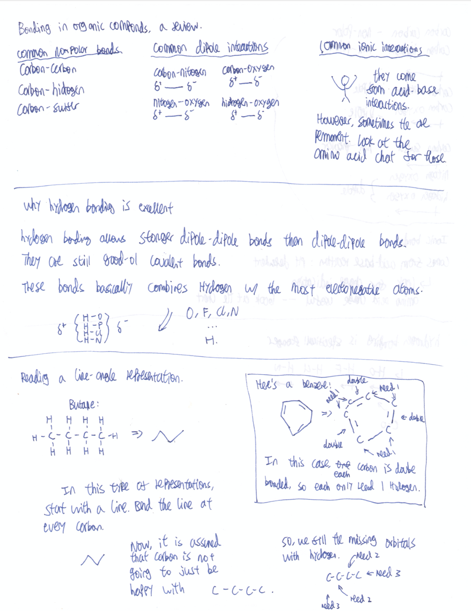

# Bio-Molecules Quiz Review

## Paul's Review Sheet
[... is here](https://docs.google.com/document/d/1wGN3RNZCN-hkP2gJe2C7FHGZi_-YfCE6aJCZy-0N53s/edit)

And Jack's raw answers: [[KBhBIO201BioMoleculesRAW]]

## Plasma Membrane Structure + transport
* Cell transport process

* Defining...
	* Isotonic => inside and outside have the same level of "osmolarity": probablility for osmosis to happen through a semipermiable membrane
	* Hypertonic => inside has less osmolarity than the outside: water/other elems will flow out of the cell
	* Hypotonic => outside has less osmolarity than the inside: water/other elems will flow into the cell
	
## Proteins Structures and Function
* Overall structure, monomers/building blocks, functions, and examples of proteins => [[KBhBIO101Proteins]]
* "peptide" => a chain of amino-acids
* Polymerization via dehydration
	* Take two amino acids, take the H-O out of the alcahol, take the H out of the Amine. Fill the hole with the other one
* Protein structure
	* Primary structure, secondary structure => [[KBhBIO101Proteins]]
	* Amino acids, N & C terminus => [[KBhBIO101AminoAcids]]. N terminus (Amine), C terminus (Carbolixic.)
	* Secondary structure — H bonds between H-O, H-N
	* Tertiary structure => see the [[KBhBIO101Proteins]] articles
* The functions of proteins are varied because the primary sequence can be varied, effectively building any shape protein to do its specific function
* Form = function is the idea that the shape or form a protein takes through the combination of primary, secondary, tertiary, or quaternary structure determines how it will then function. Any changes to the structure will have some impact on its function and the more the structure is affected the more the function is likely to impacted
* Functions => defense, movement, structure, transport, cell to cell signaling, etc.

## Cell Structure
* Enzymes? [[KBhBIO101Enzymes]]

OK, so. Apparently Paul just answered the rest of his questions.

And I quote

"""

**Enzymes are catalysts. They speed reaction rates but do not affect the change in free energy of the reaction (the difference in potential energy between reactants and products).**

- Activation energy is the amount of kinetic energy required to reach the transition state of a reaction.
- Enzymes speed up a reaction by lowering the activation energy, often with the help of cofactors or coenzymes.

- **Enzymes lower the activation energy by some combination of…**
	- Orienting the reactions substrate(s) to promote more effective collisions (and therefore reactions
	- Stressing or straining bonds to temporarily and/or slightly lower the strength of attraction to allow the bond to break more easily
	- Involving amino acid R-groups or sidechains in creating the transition state between reactants and products
	
Enzymes have active sites that bring substrates together and may change shape to stabilize the transition state; known as Induced Fit upon binding active site and slight change in enzyme shape.

Most enzymes are proteins, and thus their activity can be directly influenced by modifications or environmental factors, such as temperature and pH, that alter their three-dimensional structure.

 Enzyme activity may be regulated/inhibited by molecules that compete with substrates to occupy the active site (competitive inhibitor) or alter enzyme shape so that substrates become unable to enter the active site (non-competitive inhibitor).

"""
 

## Helpful review items

