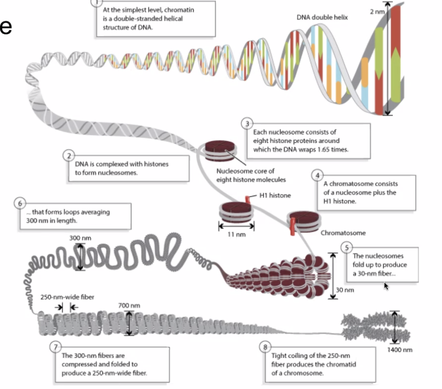
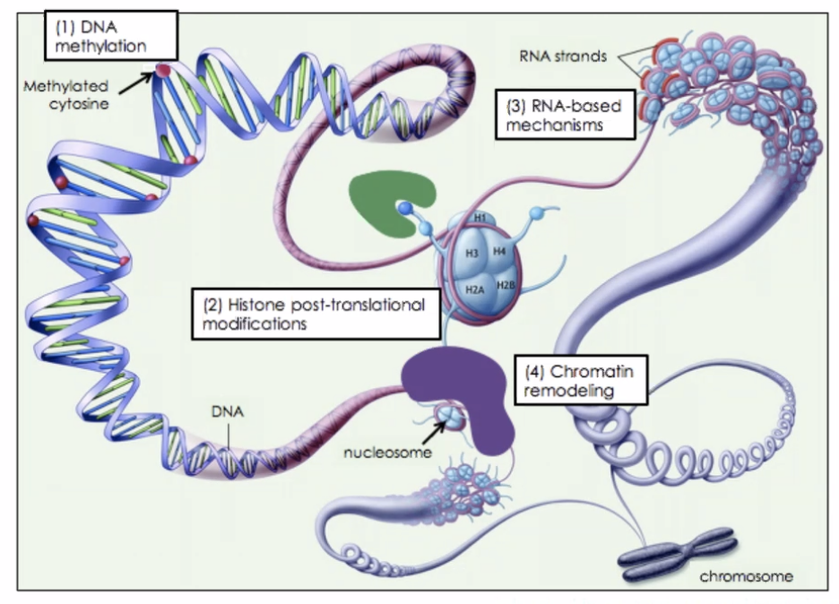

# The Cell Cycle
### So, why do cell divide
> The ability to produce organisms more of their kind is one characteristic that best distinguishes living things from nonliving matter

Viruses + Organelles challenge this definition => they are symbiotic and cannot reproduce on their own. We tend to think that cells

* Everyday, 50-70 Billion die => **programmed cell death**
* To compensate this, Mitosis (cell division) happen 
	* Cell divide in opposite directions
	* Two strands ANTIPARALLEL to each other
	
	
### Levels of DNA structure
* DNA Double Helix => Unwrapped, raw DNA
* Histones => coiler proteins at which DNA coils around
	* Four histones
	* H3, H4, H2a, H2b wraps, H1 seals the four together
	* Each protein has 1.65 wraps
* Nucleosomes => stack of 2 histone groups to create a spool of 8 histone proteins wrapping DNA
* Nucleosomes wraps around into a large fiber called "chromatin"
* A pair of chromatin entangle to form a chromasome

### Cell divison process
* Chromesomes line up in equator
* Each chromesome has two chromatid exactly the same
* Microtubials to pull chromesomes appart connected to kinecore, a joint in the chromatid
* Kinetore senses tension, and when it is correct, molecules are sent down the microtubials to send a split signal

**Most cell division results in genetically identical daughter cell**

Each cell, once specialised, chooses what parts of their chromasome to unwrap + permanently wrap.

Difference in transcription results in different phenotypes.

Sperm + Egg (imcomplete cells) combine together to form a "zygote" => a single cell. Each person is from a zygote.

For Eukarotes, cells divide using Mytosis.

[Paul's Cell Cycle Primer](https://docs.google.com/document/d/1TIrgR9VSV3attTK_QP-AOCs33mMoBP0Cz7DQXysKoD0/edit)

### Major Cell Cycle Parts
- G1 => Rest Phase, Gap 1
	- May hit s.a. to volume checkpoint => if ratio too big, the cell is too big
	- May hit diffusion checkpoint => larger cells would need to work harder to transport things to the centre
- S => S Phase, duplicate DNA. 150 mins
- G2 => Rest Phrase, Gap 2. The pairs of DNA begins bundling and condensing; the DNA is also checked upon and verified for consistency
- M => Mitosis!
	- Prophase: condensation of chromasome
	- Chromatin aligns in the center => (metaphase)
	- A divit (DEFINITION?) forms
	- Two chromatin becomes pulled apart => forming two cells via cytokenisis (anephase)
	
Cell regulators are proteins that manage and sheperard the process of cell division. They respond to molecular signals throughout the cell and check for internal signals like DNA damage to control the rate and progress of cell division.
	

	
