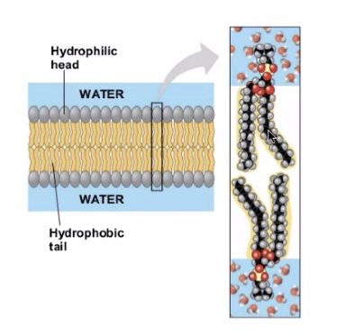

# Cell Membrane
## Fluid mosaic model

Some Phosopholipids connected as a "phosolipid bi-layer" (see [[KBhBIO101StructuresOfLipids]] structure 

- Charged head
- Nonpolar tail

So, head aligns and tail aligns, creating the basic structure of the membrane:

### Stuff in the membrane
**Cholesterol**

Helps cells communicate

**Proteans**

- Makes sure the right molecules gets in/out
- Nonpolar Oxygen + CO2 could easily get through
- Polar and charged molecules can't get through, unless...
- Channeled proteins let specific polar particles through

### Cell Transport
How chemicals get in + out of the cell

**Passive diffusion**

"Passive… Passive Diffusion": Non-Polar things simply "fall in" in the direction of chemical gradient

"Facilitated Diffusion": polar molecules selectively get through protean channels

**Active diffusion**

"Active transport": ATP shepherds elements in  

"Bulk transport": 

- Large item transport across the plasma membrane
- Transport vesicles attaches to membrane to receive elements
- Exocytosis and Endocytosis
