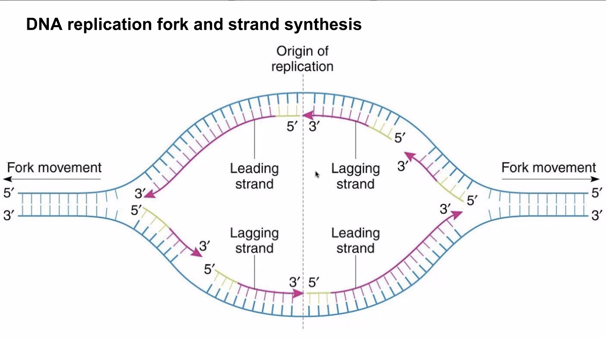

# DNA Replication

DNA replication is known to be "semi-conservative" — meaning that it is a process that pairs a synthesized half of the DNA with an original half of the DNA (i.e. takes the ORIGINAL template strand + makes the NEW coding strand & takes the ORIGINAL coding strand + makes the NEW template strand.)

Because **polymerases copy uni-directionally** => DNA polyemrease move along the 3' to 5' DNA to create a copy 5' to 3'. Meaning, the polymerize is able to add nucleotide onto the 3' end of the DNA.

As mentioned before, **DNA Polymerease** is the enzyme that catalyzes this process of DNA replication.

## The Process of DNA Replication
### DNA Unzipping
=> DNA is unzipped at the origin of replication 
The parent DNA strand serves as a template for the new strand; when it is unzipped, the nucleotides are exposed for complementary base pairing. **Helicase** is the enzyme that unzips the DNA molecule, breaking the hydrogen bonds between nucleotides to expose them for complementary base pairing 

### DNA priming
DNA polymersease will REQUIRE a double-stranded area to begin work from, so **Primase** synthesize already double-stranded RNA primers that DNA polymerease could bootstrap to the single-stranded DNA to begin the replication process (think: create-react-app)

### DNA "flexing" (what's the actual word?)
The primed DNA is broken and rejoined in order to reduce strain caused by unzipping. Topoisomerase is responsible for relieving unwinding-induced.

### The actual process of replication
In this step, DNA polymerease does we came here to do.

Because DNA polymerase could only add nucleotides 5' to 3', there is two types of styles of copying depending on which of the two strands are being copied.

* In the **leading** strand (3' to 5'), polymerase will run alongside the helicase for they are opening and replicating on the same direction
* In the **lagging** strand (5' to 3'), polymerase will wait until the helicate opens a little segment, and rushes forward and move backwards

*NOTE: the lagging strand... 1) takes longer to transcribe 2) is done in small chunks (each "rush forward"). Each chunk is called an ogazaki fragment — this is why there was that [[KBhBIO101mRNAPreprocessing]] process during transcription because that would help correct any errors in joining these fragments*


		
***
_A quick break..._

But where does the materials (the nucleotide necessary to make new DNA + primer RNA come from?)

Remember that this whole process happens in the nucleus. There's apparently just a crap tonne of random nucleotide floating around in the nucleus, so simple chemical attraction is good enough.
***

### DNA Proofreading
DNA polymerse will detect unfitting bonds and remove leftover RNA primer bootstrap units to repair them in a process called "proofreading." DNA polimersease is assisted with "glue" ligase to help the DNA polymerease pick out and replace problematic/unneeded nucleotides and perhaps their neighbors. This is where the Ogazaki fragments get joined.


Steps of DNA replication, in Paul's words:

```
- Many proteins work together in DNA replication and repair. 
The process of DNA replication is semiconservative, such that takes place through complementary base pairing of a template strand of parent DNA. 

- The process of replication begins at the origin of replication, forming a replication fork. The enzyme, helicase, unwinds DNA exposing template strands, primase synthesizes RNA primers to begin the process

- Topoisomerase breaks, swivels, and rejoins the parent DNA to relieve strain caused by unwinding. 

- DNA polymerase is the enzyme that catalyzes the process of complementary base pairing of nucleotides to the template strand. 

- New nucleotide strands always for in the 5’ to 3’ direction, therefore the leading strand forms continuously but the lagging strand is formed in Okazaki fragments (still in the 5’ to 3’ direction) and connected by the enzyme ligase. 

- DNA polymerase is able to proofread pairing, and along with mismatch repair enzymes, DNA is carefully check and repair DNA. 

- The end of a DNA molecule are called telomeres (not in circular genome e.g. bacteria), and shorten during each replication (Hayflick limit). Noncoding, repeating units of nucleotides act as protection from losing essential genetic information by shorting. 
```


***


