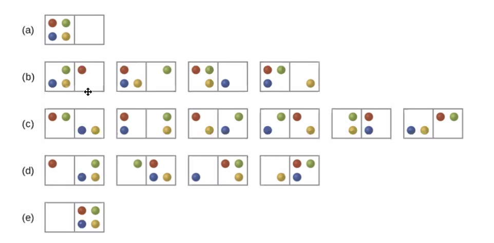

# Entropy

#flo #disorganized 	

Startistical measure of randomness in a reaction of systems. 

Entropy measured in microstates — the spead of energy in states. Greater numbers of microstates means that there is more entropy

To think about this, think about states of matter:

- Gas => Most Entropy
- Water => Meh Entropy
- Solids => Least Entropy

In this image, states (a) and (e) are least likely. This is because **the greater the spread, the greater the entropy; systems like to have an increase of entropic state as much as it is possible.**

\definition{Second Law of Thermodynamics}{In the universe, entropy is increasing due to chemical processes.}

## Gibbs Free Energy

$\Delta G = \Delta H - t \Delta S$

Change in gibbs free energy is equal to change in enthalpy minus the change in entropy multiplied by the temperature.

| $\Delta H$ | $\Delta S$ | $-T \Delta S$ | $\Delta G$ | Spontanety? | Examples? |
| --- | --- | --- | --- | --- | --- | 
| + | - | + | + | Nonspontaneus: creating less entropy, heat is going in. | TBD |
| - | + | - | - | Spontenous: creating more entropy, heat is flowing out. | Combustion Reactions ( blowing things up) |
| - | - | + | $\pm$ | Low Temp: Spontaneous   High Temp: Nonspontaneus |
