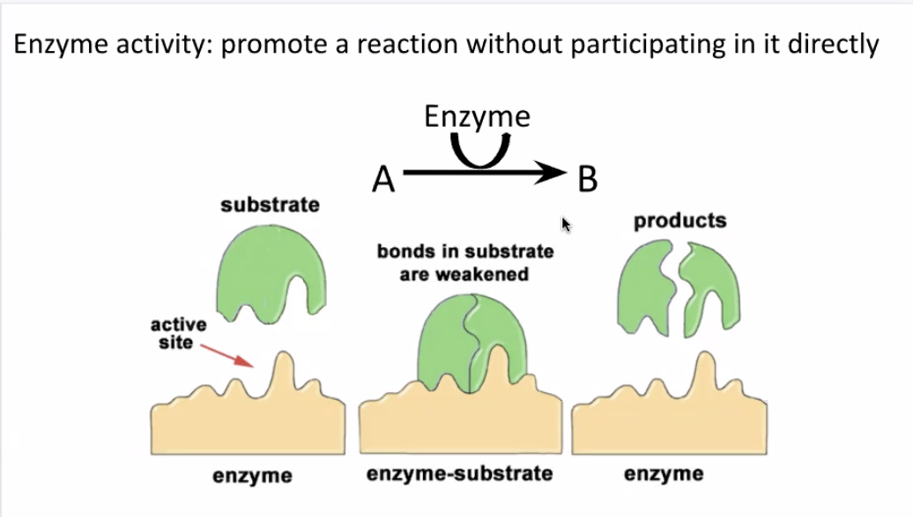

# Enzymes
Proteins that build things up and break things down! 

A macromolecular **catalyst**, it...

1. Speeds up the rate of reactions
2. Does not get consumed by the reaction
	1. Not a fundimental product
	2. Not a fundiment reactant
3.  Shape determines the reactions that it can participate in
4.  Enzymes are subject to **protean denaturation** => if the protein unfolds, its function will be lost. Triggered by excess heat, acid, and other problems

(4) is unlike non-protein, inorganic catalyst — inorganic non-proteins need to unwrap or wrap.

The process of enzymes doing things.

1. The reactant (called "substrate") fits into a pocket ("active site") in the enzyme for the reaction to occur. Yes, there could be multiple active sites for multiple reactants
2. The enzyme rearrange itself slightly to hold the enzyme in place
3. A cofactor ("catalyst to the catalyst")  also bind to the active sites
