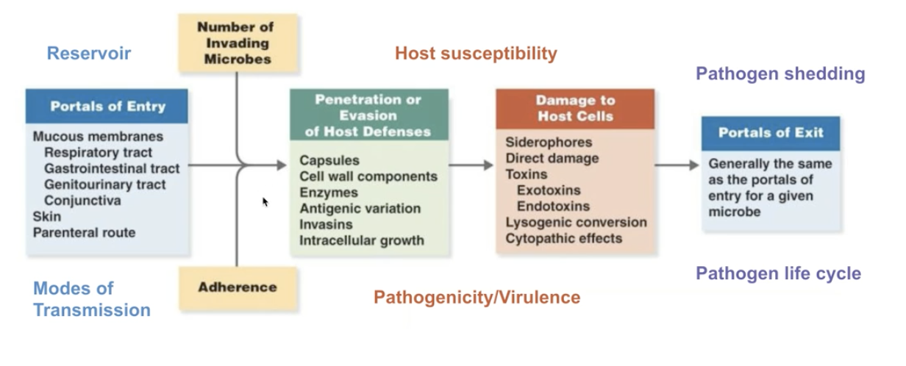

# Overview of Human Diseases
A lecture by Paul.

#flo #disorganized 

**Disease** is an abnormal condition that causes impairment in/loss of function of an organism (a.k.a. decreased fitness) that is not due to immediate external injury.
	
* What causes human disease?
	* Infectious agents
	* Deficiency disorders
	* Heritable factors
	* Physiological disorders (immunodeficiency, autoimmune disorders, allergies, etc.)
	
## Congenital vs. Acquired disease

Congenital diseases => diseases present at birth due to DNA abnormalities / pregnancy pathological issues

Acquired diseases => diseases that begin during lifetime, including...

* Microrganism invasion => "infectios diseases"
* Autoimmune reaction
* Nutrient deficiency
* Mechanical wear
* Ingestion of noxious chemicals

**Infectious diseases actually smaller on the causes of death in the US**

* Heart disease => wear + deficiency 
* Cancer => heritable + DNA
* Unintentional injuries => not a disease
* Chronic respitory disease => wear
* Stroke => not a disease
* Alhetimer disease => wear
* Diabetes => autoimmune, nutrient, wear
* Influenca <= **here, finally, an infections disease.**

## Disease causing agents
* **Protozoan** => single-celled eukaryotes
* **Fungal** => single/multi-celled eukarotyes
* **Bacteria** => single-celled prokaryotes
* **Viral** => acellular parasitic infectious agent
* **Helminuthus** => multicellular worms
* **Prions** => acellular misfolded proteins
* **Viroids** => infections nucleic acids w/o protein coat to make virus

## Pathogenicity + Virulence

**Pathoginecity** => relative capacity to cause disease

- Non-pathogenic agents => no diesease
- Primary pathogens => yes disease
- Opportunistic pathogens => yes disease only when it can, for instance, in immunocompromised individuals

**Virulence** => numerical measures for pathonicity

- Measured experimentally with LD50 + ED50

***

## Overview of various diseases

[This video](https://drive.google.com/file/d/1WRnbgkhnmRrdP4ZqlqT3HHBD1_eW9qib/view)

### Protozoan

* **Protozoan factors** => direction pathogenisis leading to tissue damage
* **Host-mediated factors** => immune evation + escape mechnisms + immunalsupression

Adaptable!!

### Fungal

* **Fungal factors** => many shapes and very adaptable, colud produced specialized enzymes to take root in body
* **Host-mediated factors** => cause immunocomprimzation, acquired though inhalation, etc.

### Bacteria

* **Bacterial-induced toxicity** => produces toxins + has hard capsule cell
* **Host-mediated factors** => may develop host resistance, could compete for resources, and could be grown introcellularly

***

## Bacteria causing diseases

**Biofilm formation**

- Communities of bacteria could work together by adhering and exchanging information
- Bacterial could perform quorum sensing => exchange of information with each other + recognize various members of their group

### Fighting bacterial infections

**Antibiotics** => drugs with selective toxicity for specific bacterial types

Act by...

* Disrupting membrane + cell wall integrity
* Selectively target + impair bacterial ribosomes
* Block bacterial DNA replication/transcription
* Inhibit bacterial metabolism

## Viruses causing diseases
* Viruses => acellular macromolecular assemblies
	* Contain protein coat called capsid
	* DNA or RNA, but not both
	* Are obligate parasites that could only replicate within host
* Assembled and mature viral particles => virions, which contain...
	* Capsid
	* Genetic material
	* Occationally outside lipid layer 
*  Viruses exist on the nanometre scale, but they are difference in share and size
* Structure of viruses
	* **All contain**
		* Capsid => structural protein coat
		* Genome => RNA/DNA; but not both
	* **Some contain**
		* Membraneous-enclosed capsid => envelope
		* Externally-facisg host-cell fusion proteins => spikes
		* Viral genome replication enzymes => prlymerases
		* Other proteins for fun => enzymes, motor proteins, transcription factors, host-cell interacting proteins, etc.
*  

