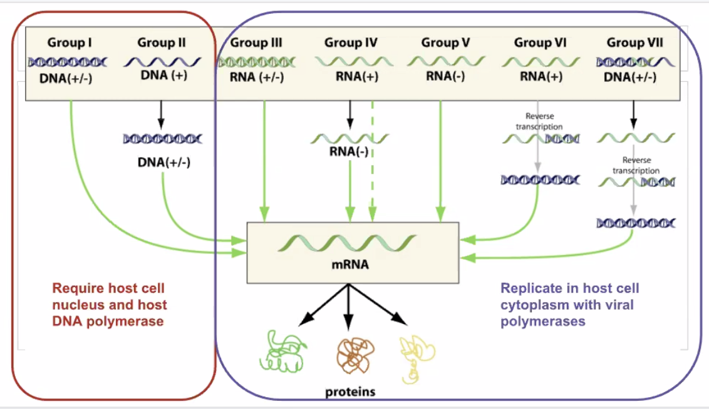

# Overview of Human Diseases
A lecture by the Legendary Dr. Paul Hauser. [Slides are here](https://docs.google.com/presentation/d/1b2RetU6iGsd_h4Msb2SV-_WznNXSREbsPpfdY-LgJZs/edit#slide=id.ga6d683dbbf_0_338)

#flo #disorganized 

* Viral proteins are usually easy to assemble

**Question: how are proteins made in the viral genome**

* No viruses produce ribosomes
* Ribosomes become centrally important for the virus
* What serves as the template to make new virus copies

**DNA** viruses are "less complex", in that as long as they are able to get into the nucleaus, the rest would just be the body's work automatically.