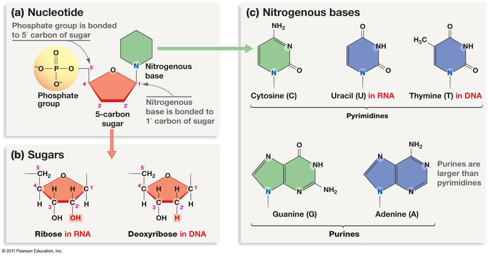
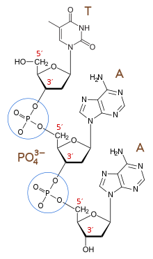

# DNA/RNA

## Nucleic Acids

d-Oxy Ribone Nucleic Acid: DNA
Ribone Nucleic Acid: RNA

**All nucleic acids are comprised of monomer units that's synthesized together into polymers.** => Just like [[KBhBIO101Carbs]] or [[KBhBIO101AminoAcids]]

## 3 basic parts of a Nucleic Acid
Two parts of the backbone (phosphate and sugar) + a nitrogenous base that labels what type of nucleotide this is.

### Backbone 
- phosphate group
- sugar (Ribos => sugar in RNA, di-oxy Ribos => sugar in DNA)=> In di-oby Ribos: a OH pair is replaced with a hydrogen **only in one position.** Hence "di-oxy"

### nitrogenous base
- Bases in DNA
	- A, T, G, C
- Bases in RNA
	- A, U, G, C

How do we make nucleic acids? Can you guess? Huh? **Dehydration synthesis!**

## Shapes of the DNA
### DNA/RNA Primality
- 5' => one end of an RNA/DNA part (connection from the phosphate group)
- 3' => another end of a RNA/DNA part (connection from the third carbon on the sugar counting from left)

**As in...**

### DNA/RNA Strand
* DNA is supposed to be double stranded: DNA is *anti-parallel* to each other => 5' to 3' backbone parallel to 3' to 5' backbone
* RNA is supposed to be single stranded, but viruses may give them in bundles so that it would avoid detection

| Type | Identifier | Purpose |
|---|---|---|
| DNA 3'...5' | DNA Antisense/Noncoding/Template Strand | Used as a template for transcription |
| DNA 5'...3' | DNA Sense/Coding/Nontemplate Strand | The complement to the template strand + what is being used (bar urisil) |
 
**Temp copies of genome is RNA, permanent record in DNA**
 
 ## The Central Dogma
 The process of the central dogma is a rough path by which DNA is converted into Proteins. This helps us understand how proteins are made in a cell, and also how viruses could hijack this process to make themselves.
 
 See [[KBhBIO101CentralDogma]] 
 
## DNA-Made Structures
In a [[KBhBIO101Cells]], DNA is organized into different shapes depending on which [[KBhBIO101CellCycle]] that the cell is in. These structures help facilitate cell replication.

See [[KBhBIO101DNAStructures]]
 