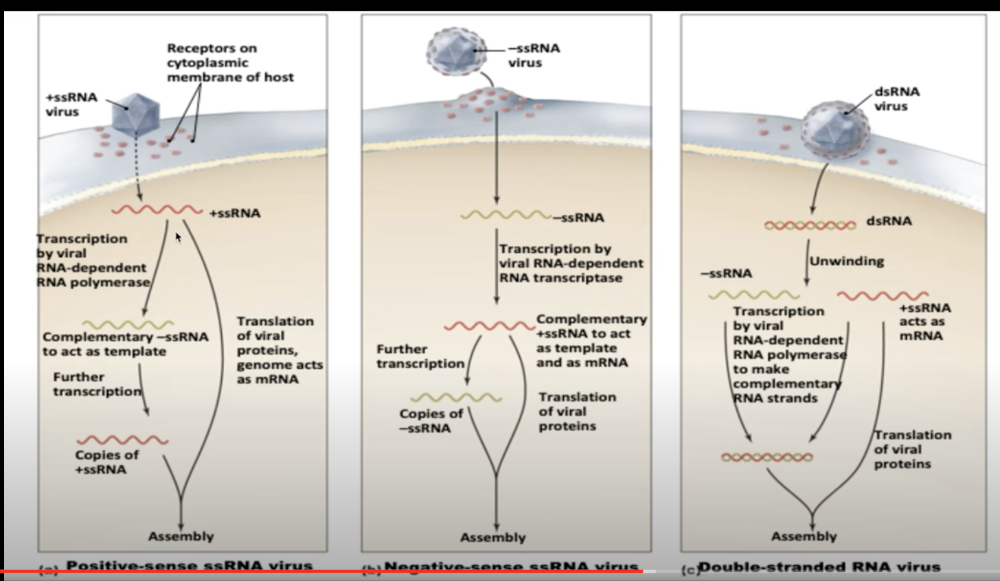

# RNA Replication

* +Strand: reproducable RNA => could be directly translated by the ribosomes
* -Strand RNA: useless template RNA (less easy to be detected)
	- Need to be processed by RDRP (RNA-dependent RNA Polymerease)
	- Once entered the cell, RDRP goes to work copying -Strand RNA to +Strang RNA 

- double-stranded RNA viron => (+, a.k.a. sense) 
	- +-stranded RNA => same idea as above
	- - strand RNA => virus comes with RDRP that convert -ssRNA to +ssRNA. Then, same idea as above. 

*What serves as the templates for viral genome replication?*

* RNA viruses does not need host-cell polymeraese to copy RNA
* They come with polymerase that...
	* with dsRNA; takes +ssRNA and makes -ssRMA; combining the two to produce dsRNA
	* with +ssRNA, takes +ssRNA and makes temporary -ssRNA which makes more +ssRNA
	* with -ssRNA, takes -ssRNA, and makes temporary +ssRNA, which makes -ssRNA

