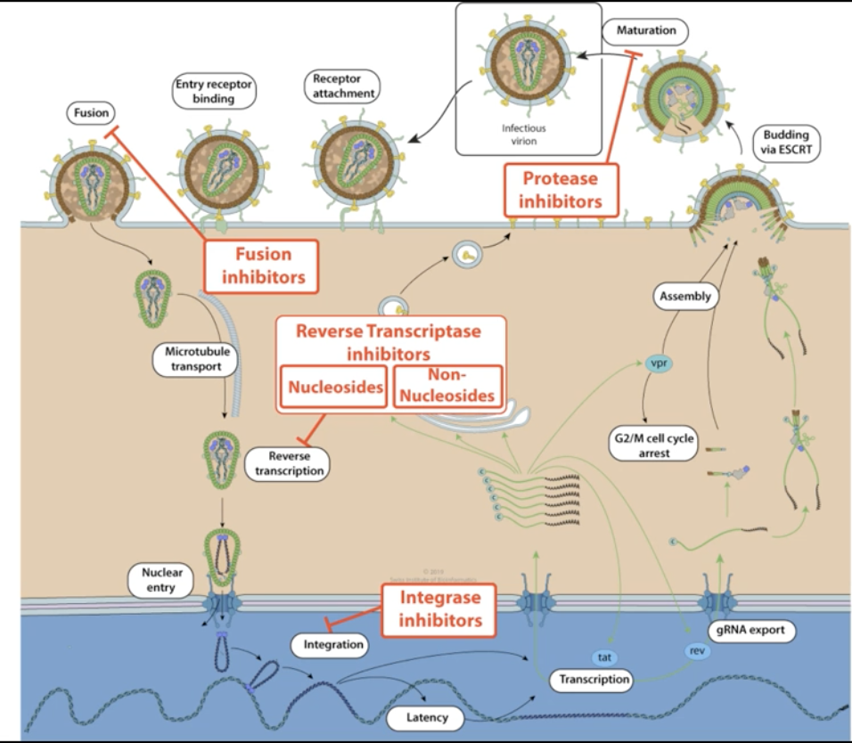
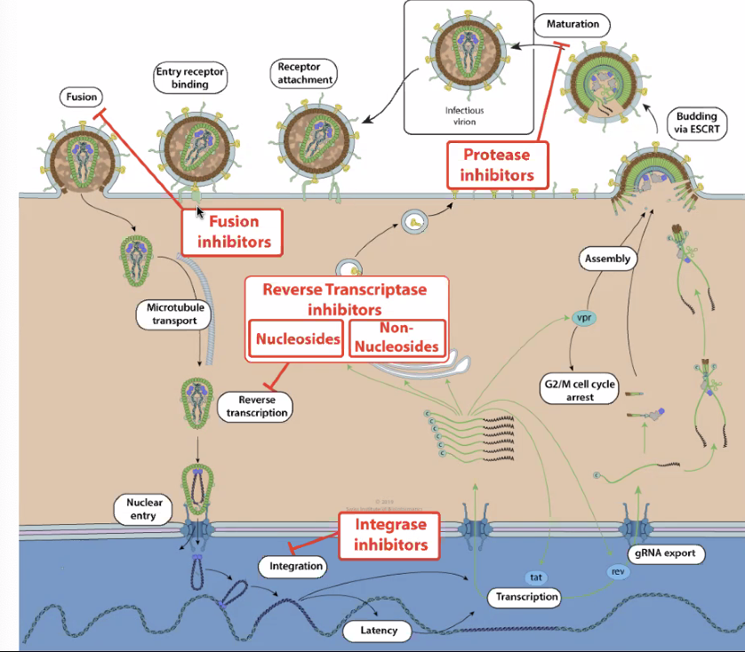

# Retroviruses
**Viruses that have the ability to intergrate into the chromosomes of the host cell**

## Retroviruses, infection
Normal [[KBhBIO101ViralInfection]] infection stuff happen, but then...

* As the virus is uncoated, it uses an enzyme called "reverse transcriptaese" to turn ssRNA to cDNA, and finally into dsDNA (template strand DNA).
* And, ready for this? The virus then uses an enzyme called **intergraese** to thread the viral dsDNA into the cell's normal nucleaus

A bonus for HIV (which is a Retrovirus) — it utilities **protease** to cut HIV's polyproteins into individual parts ready for budding.

## Retroviruses, Late Stage
The proviral region (the part that makes virus) newly inserted to the cell's DNA is transcribed slowly when normal [[KBhBIO101CentralDogma]] comes across it to synthesize proteins. In this case, this virus would spread through cell duplication

When the cell is undergoing [[KBhBIO101CellLifecycle]], the proviral area is replicated and exported as usual, making descendents of the cell also have the proviral region. This property makes these viruses especially hard to get rid of, which is why we still can't cure HIV.

***

To make these activities happen, the virus needs two enzymes — **Reverse Transcriptaese** + **Intergraese**

- **Reverse Transcriptase**
	- Transcript RNA to double-stranded RNA
	- Take double-stranded RNA to turn into DNA
- **Integrase**
	- Force insert the DNA into the genome of the host cell

***

## Preventing Retroviruses
There are a few different drugs that prevent a few different steps of the retroviral infection process

* Prevent [[KBhBIO101ViralEntry]] `gp120`, `gp41`, `CCR5`
* Prevent reverse transcription — turn viral ssRNA to dsDNA  `RT`
* Prevent intergration via **intergrease** `IN`
* Prevent viron maturation (namely, **protease** function) `PR`

Most advanced treatment: HAART (Highly-Active Anti-Retroviral Therapy)

- Cocktail drug works together for inhibition
- Two drugs to stop intergration, one to stop protease (viron maturation)
- Could develop resistance

