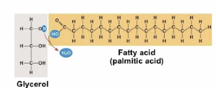
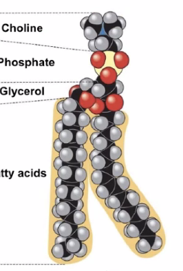

# Structure of Lipids

## Fatty acids

A single penteine and embellishments. **Single Fatty acids = Glycerol**

## Trygricerol
**Fat! (a.k.a. adapose tissue) = Triglycerol: three gcycerals together.**

### Saturated vs. Unsaturated fats
**Saturate Fats**
_No double bonds_ in the carbon chain — think! butter

**Unsaturated Fats**
_Double bonds_ in the carbon chain — think! olive oils

Saturated fats has a higher melting point then the unsaturated fats, but unsaturated fats have double bonds whereas saturated fats have single bonds only. Why?

* Double bonds, due to their caused VESPR geometry (and hence the -1 hydrogen), are curved. This makes it harder to stack together, causing a lower melting point
* Single bonds, due to their caused VESPR geometry, is flat. This makes them easier to stack together, causing a higher melting point.

## Phosophilids
**2 fatty acids (hydrophobic) + phosphate group (hydrophillic)**

A combination of many of these will end up with membrane:

The hydrophobic tail stays inside, and the hydrophillic head pokes outside and attracts water.

## Liposomes + micelles
**Lots of phosophillids**

A same idea as phosophilids, but instead in a big wad of balls. this arrangement is also how basic cells form membraines.