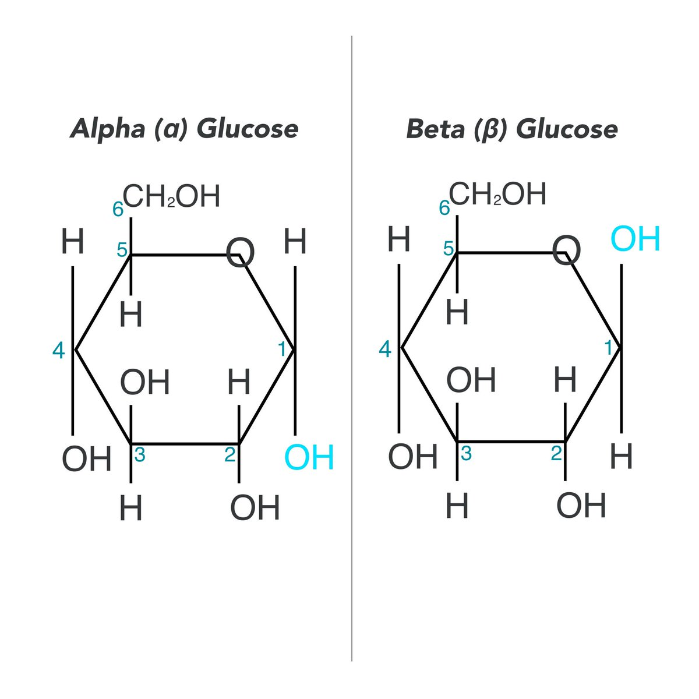

# Structures of Carbohydrates
Each carbohydrate could be a monomer (6 carbons, simple structure). A carbohydrate monomer (simple sugar) is called a "monosacharide"

* Two monomers could be chained to build a more complicated structure named Disachoride
* Monomers could be chained to build "polymers"
* Complicated polymers is what forms the energy builds of life
* The same atoms, with different bonds and hence a different species, result in "isomers"

General chemical formula: $C_n H_{2n} O$

- Monosacharride => a monomer of carbohydrates
- Disachoride => a dinomer (?) of carbohydrates
- Polysachride => a polymer of carbohydrates

## Basic Monomers
- Glucose: ring of 6 carbons
- Fructose: ring of 5 carbons

## The mer-library

| Name      | Note                                    | Composition                                                                    |
|-----------|-----------------------------------------|--------------------------------------------------------------------------------|
| Sucrose   | Common Sugar                            | Disachoride: Glucose + Fructose                                                |
| Lactose   | The thing that's in milk                | Disachoride: Glucose + Galactose                                               |
| Cellose   | Plants' cell wall we can't digest | Polysacharides from: beta-Glucose |
| Glucose   | Bulding block of sugar                  | Monomer                                                                        |
| Galactose | Sugar sweeter than sugar | Monomer                                                                        |
| Fructose  | Controvercial                           | Monomer                                                                        |
| Starch | Plant food reserve | Small, branched alpha glucose |
| Glycogen | ANimal energy reserve | Lots of alpha glucose in more branches |

## Making and Breaking -mers
**Creating a polymer ("dehydration")**

* Take monomers
* Remove water molecules
* Fill the now-gaping hole with the next monomers

**Breaking a polymer ("rehydration")**

* Take polymers
* Add water
* Get Glucose
* Profit!

Hence, you get thirsty after around 45mins whenever you eat lots of sugar — ye gotta get that water to rehydrate and break down those polymers.

Bonds are called "glycocidic" bonds

## Alpha vs Beta glucose

***

And now, a note on energy.

[[KBhBIO101Enthalpy]]

***

You could add even more monosachrides/disacharides up to get polysacharides (starch, fiber, glycogen)

* We get energy for lots of glucose (the alpha variant of which's polysacharide is starch), but we can't get any from cellulose (whose polysacratide is fiber)
* We eat fiber to maintain gut health + poop goodly. Cellulose is hydrophillic, meaning that fiber makes your guts lubricated. 
* Polysaccharides linked together by **glycosidic bonds**.

NOTE! **Whichever carbohydrates you are using, you get energy from breaking its bonds.**
