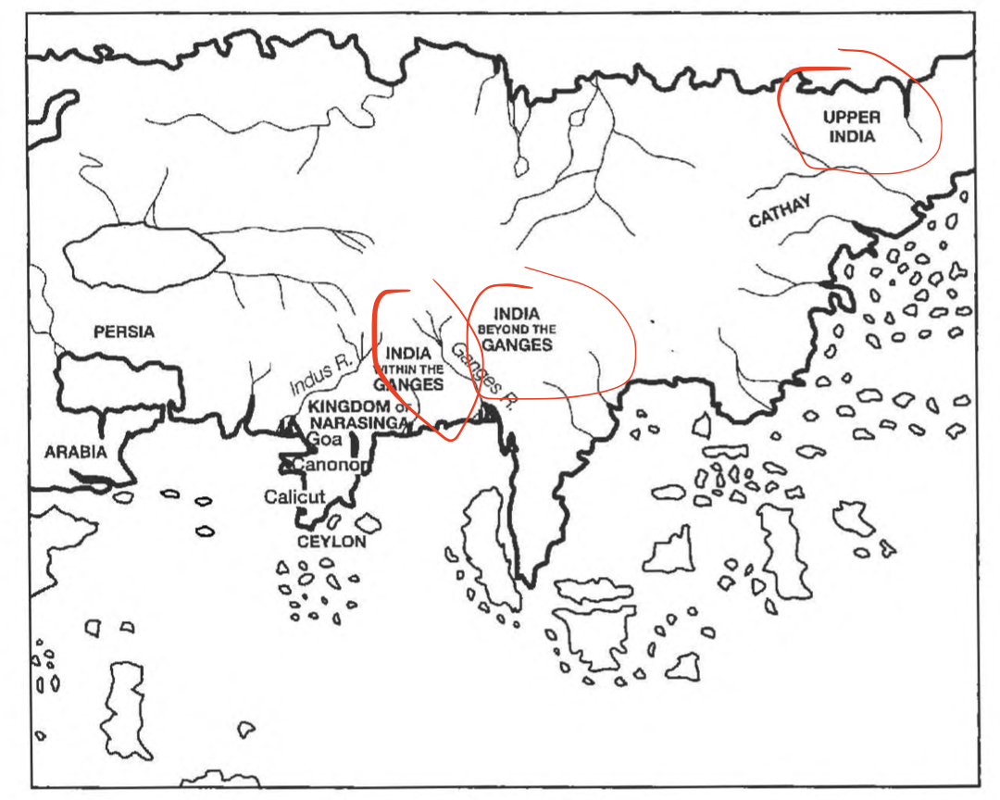

# Trauttmann
* India affected by the successful expansion of Islam
	* Created globalized multiculturalism
	* Expanded Indian ideas and invention to Europe 
		* Chess
		* Folktale collection
		* *Panchatantra* animal fables
		* Literally Zero
		* And, Arabic Numerals (#what)
* Europeans interact with India
	* Indian very strange for Europeans
	* Created legacies and mysteries about India
	* CLAIM: Images/representations were dreamlike
		* Misrepresentation goes back to greco-Roman times
		* Viewed India as a land of strange people + desirable luxuries
	* Originally leveraged the Muslims as the point of trade, but later developed desire to handle trade w/ India independently
		* One attempt to do that failed very badly, i.e. Colombus. We all know where he ended up.
		* India was thought as sprawled throughout Asia, as in...

* Portugal in India
	* Created the first effective voyages in the Indian direction
	* Traveled around Africa to reach the coast of India, dominating Euro-asian trade
	* Created treaties with local governments
	* Established seaborne trade domination by requiring trading licenses
	* Supplied local governments with resources
		* American crops: potatos and corn
		* Luxuries: tobacco and pineapple
		* Other foods: tomatos and chilli
	* Also, brought Catholic Christanity with them; who could have guessed?
		* Converted Indians
		* Established Roman Pope's supermicy over already Existant Thomas Christians
		* Employed two strategies
			* Please the Indians: adopted the form of a brahmin renouncer
			* Force the Indians: instituted Inquisition to force orthodoxy
* Porchugual vs. Spain
	* Squabble squabble squabble
	* Eventually the... Pope? settled the issue: awarding Portugal every to the east of Brazil and Spain everything to the west
* Merchant Companies
	* Novel trading strategies
	* Created companies with independent armies that traded
	* Promoted merchantilists monopolies on a region/a good
	*   
