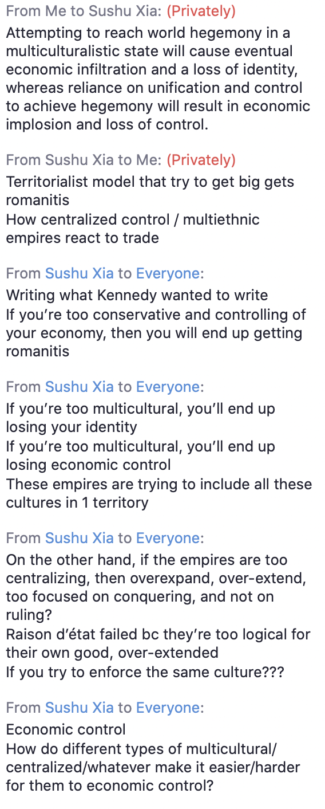

# Unit 1 Essay
## General Information

| Due Date | Topic                                              | Important Documents        |
|----------|----------------------------------------------------|----------------------------|
| Oct 12th | Hegemony and competition in the early modern world | Kennedy, Mann, and Friends |

## Prompt

<!--
Cultural: Confucianism, Islam, and Christianity play varying roles in the political and economic decisions of the major regions of world (Ming/Qing, Ottomans/Mughals, Europe). **How did culture influence the relative success of commerce and/or state formation in these regions? Was the influence positive or negative ? Were there wider ramifications?**
Include in your essay at least two religions. Sources for: Christianity (McNeill, Kissinger), Confucianism (resources from your Kennedy essay), Islam (Bulliet, Gilbert, some Gelvin).
-->

Economic: The Ottomans, the Ming and Qing Empires, the Mughals and the European kingdoms all responded to the globalization of commerce in the early modern period in dramatically different ways. **Why did they respond differently to the globalization of commerce and what were the consequences?**
Comparing at least two of the regions above. Gelvin (World systems), Mann (silver), Kennedy and Arrighi might be good general frameworks, while Bulliet (Ottomans), Gilbert (Mughals) and McNeill (Europe) can provide some specifics.

## Documents Corner
- @[[KBhHIST201HomogenosceneLN]] Current day, emphasis was placed around those in native American regions who were anti-Spanish, yet a large majority of the individuals who really brought globalization were Spanish 
- @[[KBhHIST201MannMing]] China's currency began to show strain as Bronze prices increase whist China deals with a botching reopening plan after closing the economy after Zheng He. See [[KBhHIST201ChinasDeclineWRTReopening]] and [[KBhHIST201ChinasDeclineWRTZhengHe]]
- @[[KBhHIST201Ottomans1500]]   Enjoys control of the silk read; Huge landmass; Large army (and, large cannons + siege trains); Strong Navy! => deployed frequently in the Black Sea, Constantinople, North Africa
	- Enjoyed physical control: Strategic link between Europe + Asia at the Daranelles strait 
- @[[KBhHIST201ProblemsWithSilver]]  — major globalization
 
 
 ## Evidence bin
- The Holy Roman Empire
	- "A ruler committed to such absolute values found it impossible to compromise, let alone to manipulate, his bargaining position." => Conservatism lead them directly to not compromise, getting the lower hand
- The Ottomans	
	- ...Established trade agreements "Such trade agreements, called capitulations, led to European domination of Ottoman seaborne trade. ... Far from seeing Europe as the enemy that would eventually dismantle the empire, the Istanbul elite experimented with European clothing and furniture styles" => new styles infiltrated the government causing a lack of response or even capitulation
- The French
	- "Though privately religious, Richlieu viewed his duties as minister in entirely secular terms. ... 'The state has no immortality, its salvation is now or never.'  In other words, states do not receive credit in any world for doing what is right; they are only rewarded for being strong enough to do what is necessary." => French took the stance of absolute logic and assertion of contr
- Ming
	- Tried to assert control — “Northwestern Foreigners are recalcitrant and their greed knows no bounds. I do not think our present trade with them will ensure us a century of peace. ... As to the foreigners in the southeast, their goods are useful to us just as ours are to them. To use what one has to exchange for what one does not have is what trade is all about. Moreover, these foreigners trade with China under the name of tributary contributions. That means China’s authority is established and the foreigners are submissive" => Pick and choose the outcomes only to establish authority
	
	
## Claim Synthesis
### Development phase – How and So-What
* Orthodoxy on religion => non-compromise 
* New styles infiltrated the government => a lack of response or even capitulation => overeliance on multicultralism
* Absolute logic and assertion => overpower and compensation
* Assertion of control => internal collapse => over-reliance on globalization

Musing:
* Attempting to reach world hegemony in a multiculturalistic state will cause eventual economic infiltration and a loss of identity, whereas reliance on unification and control to achieve hegemony will result in economic implosion and loss of control.
* So... Per Arrigi
	* A "territorialist model" => economic implosion	
		* Ming w/ the Mann
	* A "capitalist model" => economic infiltration
	
If you too multicultural, you may end up loosing your economic control. Empires are trying to include all these cultures in one territory.

The Ottomans, for instance, Established trade agreements "Such trade agreements, called capitulations, led to European domination of Ottoman seaborne trade. ... Far from seeing Europe as the enemy that would eventually dismantle the empire, the Istanbul elite experimented with European clothing and furniture styles" => new styles infiltrated the government causing a lack of response or even capitulation (Bulliet)

If you tried to overly unify your cultural identity, you may end up loosing your civil control.

Mughals => tried model of unity — loosing support of Hindu nobels "The combination of anti-Hindu policy and sentiment at court and the reduction in the value of subsidies or land grants to Maratha mansab dars turned Shivaji into not merely a rebel but a rival." => causing the series of decline that the Mughals saw initiated with the Maratha rebelion.

How do different types of multicultural/centralization makes it easier/harder

***
There is always [UCLA Writing Lab](https://wp.ucla.edu/wp-content/uploads/2016/01/UWC_handouts_What-How-So-What-Thesis-revised-5-4-15-RZ.pdf)
