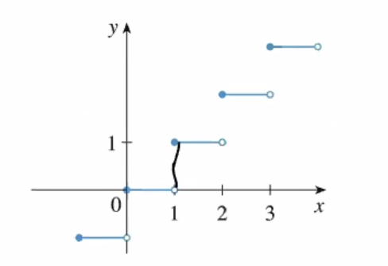

# Limits
## Warming up
Here's a function

$y = \frac{1}{x}$. 

We know that it has

* Domain $D (-\infty, 0)(0, \infty)$
* Range $R (-\infty, 0)(0, \infty)$
* $As\ x\to\infty,\ y\to0$
* Function is *odd*, that is, $f(-x) = -f(x)$

## The Limit Notation
See [[KBhMATH401TheLimitNotation]]

## Computing Limits Algebraically
See [[KBMATH401ComputingLimits]]

## Types of Discontinuity
See [[KBhMATH401Discontinuity]]

## Error and Epsilon Delta Proofs
See [[KbhMATH401EpsilonDeltaProofs]]

## CN10062020 Continuity
#disorganized #flo 

$\lim_{x \to a} f(x) \neq f(a)$.

Sometimes 

*A function is continuous at $x=a$ if ALL OF the following thr

1. $\lim_{x\to a} f(x)$ exists
2. $f(a)$ exists
3. $\lim_{x\to a} f(x) = f(a)$

\definition{Removable discontinuity}{Removeable discontinuity are often holes. They are discontinuities that, with an additional definition, one could remove.}

For instance, $f(x) = \frac{x^2-x-2}{x-2}$ has a hole at $x=2$, but if we defined a value for $x=2$, our lovely discontinuity is immediately removed.

\defintion{Infitinite discontinuity}{Functions that approch infinity}

\definition{Jump discontinuity}{"Staircase" functions that causes jump}

Like...

As you could see, if you 

