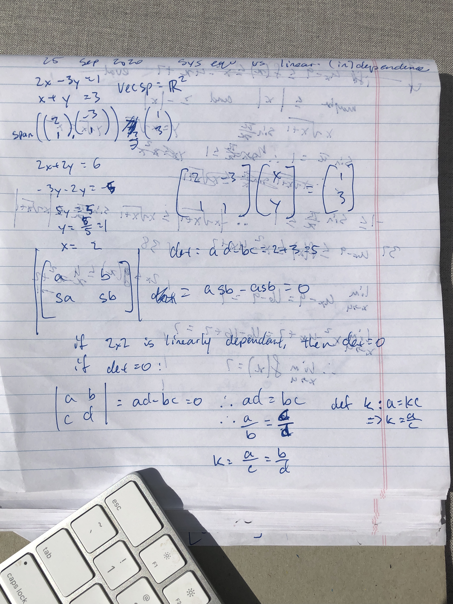
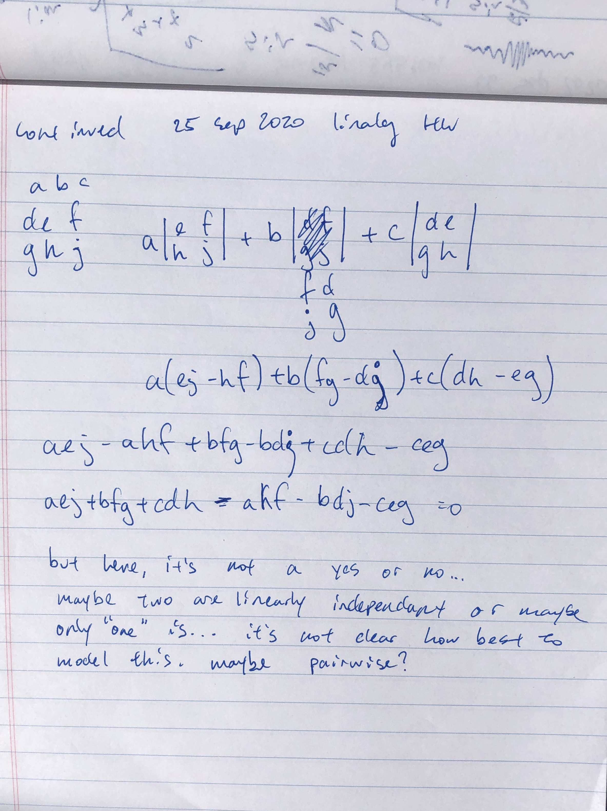

# Prompt
> Which of the following systems have a unique solution? You do NOT have to solve the 3 variable system by hand; you can graph it or use other resources.
> What does this have to do with linearly dependent/independent vectors??

# Ideas

I first focused on the systems of 2 var 2 equs. I thought of the first set
$$
\begin{aligned}
2x-3y=1\\
x+3y=3
\end{aligned}
$$
as asking
$$
(1, 3) \stackrel{?}{\in} \text{span}\left((2,1), (- ,31)\right)
$$
but that didn't really get me anywhere.

It seems pretty clear that if the lines intersect at one point, then they are not parallel and thus the vectors they represent are linearly independent. 

Then, I tried writing it as a matrix equation:
$$
\begin{bmatrix}2&-3\\1&1\end{bmatrix} \begin{bmatrix}x\\y\end{bmatrix} = \begin{bmatrix}1\\3\end{bmatrix}
$$
I figured that because we wanted to know whether the system is linearly independent or not, which is a boolean value, I had to compress the matrix down to some number that can then be compared. The only way I know how to do that is by taking the determinant, so I tried to find some connection between the determinant of a 2x2 matrix and whether it's component rows interpreted as vectors of $\mathbb{F}^2$ are linearly dependant.

# Lemma
A pair of vectors $u, v$ in a vector space $V$ over $\mathbb{F}^2$ are linearly dependent iff $\left|\begin{matrix}u_1&u_2\\v_1&v_2\end{matrix}\right| = 0$.

# Proof
## In the forwards direction
Showing that if $u, v$ are linearly dependent, then $$\left|\begin{matrix}u_1&u_2\\v_1&v_2\end{matrix}\right| = 0$$
Suppose $u, v$ are linearly dependent. Then, we can write $v$ as $au : a \in \mathbb{F}$. Then the target determinant can be written as
$$\left|\begin{matrix}u_1&u_2\\au_1&au_2\end{matrix}\right| = u_1au_2 + - u_2au_1$$
Because $u_1au_2$ is the inverse of $-u_2au_1$, their sum is clearly $0$.

## In the reverse direction
Showing that if $\left|\begin{matrix}a&b\\c&d\end{matrix}\right| = 0$, then the vectors $(a, b), (c, d)$ are linearly dependent.

Two vectors $u,v\in\mathbb{F}^2 : u = (a, b), v = (c, d)$ and $a,b,c,d \in \mathbb{F}$ are linearly dependent if one is a linear combination of the other, or $(a, b) = u = kv = (kc, kd)$ wlog.
$$
\begin{aligned}
\left|\begin{matrix}a&b\\c&d\end{matrix}\right| &= ad-bc = 0\\
&\Rightarrow ad=bc\\
&\Rightarrow \frac{a}{c} = \frac{b}{d}
\end{aligned}
$$
If we define
$$k = \frac{a}{c} = \frac{b}{d}$$
then it is clear that 
$$
\begin{aligned}
a &= kc\\
b &= kd\\
&\Rightarrow (a,b) = (kc, kd)\\
\end{aligned}
$$
completing the proof. (I couldn't figure out how to right align $\blacksquare$.)

# More Ideas
I wonder if it generalizes to 3x3 or NxN?

No conclusion.

---
