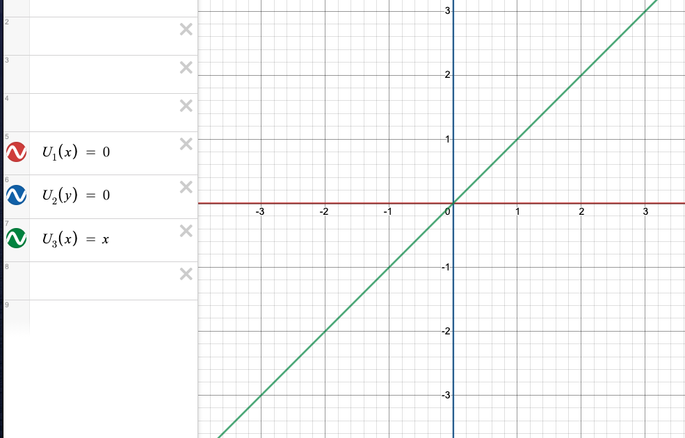

# Problem

> Prove or give a counterexample: $$
> \begin{aligned}
> \text{dim}(U_1+U_2+U_3)\\
> =&\text{dim}\ U_1 + \text{dim}\ U_2 + \text{dim}\ U_3\\
> &-\text{dim}(U_1 \cap U_2)-\text{dim}(U_1 \cap U_3) - \text{dim}(U_2 \cap U_3)\\
> &+\text{dim}(U_1\cap U_2 \cap U_3)
> \end{aligned}
> $$

# Reasoning

By Axler2.41 we know that

$$
\text{dim}(U_1 + U_2) = \text{dim}\ U_1 + \text{dim}\ U_2 - \text{dim}(U_1 \cap U_2)
$$

By applying this formula to itself, we find that

$$
\begin{aligned}
\text{dim}(U_1 + U_2 + U_3)\\
&= \text{dim}((U_1 + U_2) + U_3)\\
&= \text{dim}(U_1 + U_2) + \text{dim}\ U_3 - \text{dim}( (U_1+U_2) \cap U_3 )\\
&= \text{dim}\ U_1 + \text{dim}\ U_2 -\text{dim}(U_1 \cap U_2) + \text{dim}\ U_3 - \text{dim}( (U_1+U_2) \cap U_3 )
\end{aligned}
$$

To show that the lemma is true, we would have to show that

$$
\begin{aligned}
\cancel{\text{dim}\ U_1 + \text{dim}\ U_2 + \text{dim}\ U_3 -\text{dim}(U_1 \cap U_2)} &-\text{dim}(U_1 \cap U_3) - \text{dim}(U_2 \cap U_3) +\text{dim}(U_1\cap U_2 \cap U_3)\\=
\cancel{\text{dim}\ U_1 + \text{dim}\ U_2 -\text{dim}(U_1 \cap U_2) + \text{dim}\ U_3} &- \text{dim}( (U_1+U_2) \cap U_3 )
\end{aligned}
$$

and to provide a counterexample, we just need to find some $U_1$, $U_2$,
$U_3$ such that

$$
\text{dim}(U_1 \cap U_3) + \text{dim}(U_2 \cap U_3) - \text{dim}(U_1\cap U_2 \cap U_3) \neq \text{dim}( (U_1+U_2) \cap U_3 )
$$

# Counterexample

If we choose

$$
\begin{aligned}
U_1 = \left\{\begin{pmatrix}x\\0\end{pmatrix} : x \in \mathbb{R} \right\}\\
U_2 = \left\{\begin{pmatrix}0\\x\end{pmatrix} : x \in \mathbb{R} \right\}\\
U_3 = \left\{\begin{pmatrix}x\\x\end{pmatrix} : x \in \mathbb{R} \right\}\\
\end{aligned}
$$

then the graph of the subspaces looks like this:

and the dimesion of each intersection is $0$ while the dimension of
$(U_1+U_2) \cap U_3 = 2$. Thus, we have

$$
\begin{aligned}
\cancelto{0}{\text{dim}(U_1 \cap U_3)} + \cancelto{0}{\text{dim}(U_2 \cap U_3)} - \cancelto{0}{\text{dim}(U_1\cap U_2 \cap U_3)} \neq \text{dim}( (U_1+U_2) \cap U_3 )\\
\implies 0 \neq 2
\end{aligned}
$$

In summary, the sum of these subpsaces is $\mathbb{R}^2$ and the
dimension of the sum is 2, but $$
\begin{aligned}
\text{dim}(U_1+U_2+U_3) = 2 \neq 3 = 1 + 1 + 1 - 0 - 0 - 0 + 0
\end{aligned}
$$
