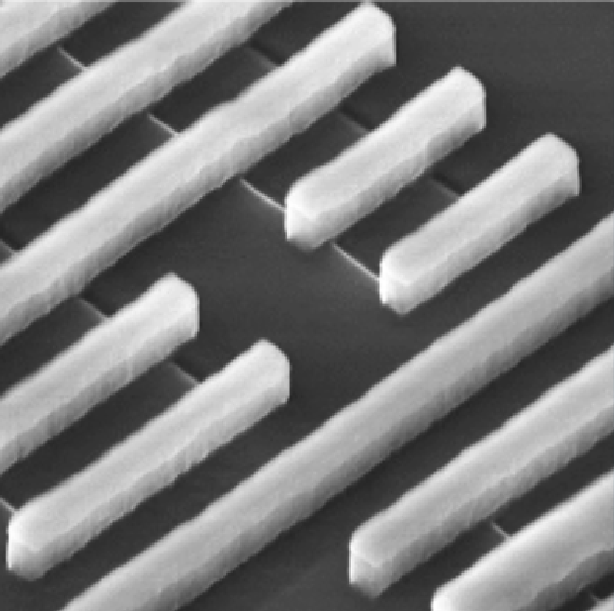

# Homework Question
> To carry signals on silicon chips, metal conductors are created. These are usually in the form of rectangular strips as seen in the highly magnified image below. Many of the conductors in this image appear to be connected to nothing, but they are making contact to structures and conductors in lower layer(s). Some are short, but others may run the entire length of the chip.

   

> “Signals” are of course nothing other than changing voltages. So imagine that at one point on the chip, a switch is closed that connects two conductors to the opposite ends of a battery. The question is, how long does it take for the other end of the conductors to reach a substantial fraction of the battery voltage?

> Assume the conductors are L meters long, H meters high, W meters wide, and are separated by S meters. The gap between the conductors is filled with an insulator having relative dielectric constant $\kappa$.

> Write an expression for the resistance of each conductor in terms of the above quantities, and the resistivity of the conductor material, $\rho$.

$$R = \frac{L\rho}{HW}$$

> Write an expression for the capacitance of the two conductors, assuming they form a parallel-plate capacitor.

$$C = \frac{\kappa \epsilon_0 LH}{S}$$

The area should be $LH$ and not $HW$, because while charge collects in the opposite corners when there is no field $E$ (in electrostatics), charge will collect on the face near the other wire in this case because we have a E field (the whole point of a capacitor).

> Combine these to estimate the time it takes for the far end of the conductors to rise to an appreciable fraction of the battery voltage. Do any of the parameters listed above cancel out?

$$\Tau = RC = \frac{L\rho}{HW} \frac{\kappa \epsilon_0 LH}{S}$$

> Assume the conductive strips are made of aluminum, L = 250 μm, k = 2, and H = W = S = 20 nanometers. What is your calculation of the time constant? Be careful with units, and check to make sure that your answer is in seconds. What does the time constant have to do with how many signals or voltage changes can be sent per second?

---
