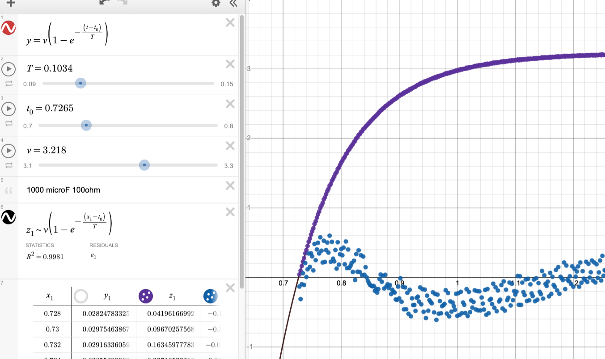

#ret 
#disorganized #incomplete

# Introduction

The purpose of this lab is to verify the relation between capacitance, resistance, voltage, and charge time of a simple capacitor circuit. The equation that will be verified is
$$
V_{cap} = V_{bat}\left(1-e^{-\frac{t}{\tau}}\right)
$$
where each variable has the following meaning:

| Variable | Units | Description |
|----------|-------|-------------|
$t$ | Seconds (s) | Time elapsed since charging of the capacitor started. May be represented as $t-t_0$, where $t$ is the current absolute time and $t_0$ is the absolute start time.
$V_{cap}$ | Volts (V) | Voltage across the capacitor after a given elapsed time
$V_{bat}$ | Volts (V) | Voltage of the battery, assumed to be constant.
$\tau$ | Seconds (s) | "Time constant" that scales the equation to the circuit. Equal to the product of the resistance and capacitance of the circuit ($RC$), and roughly equal to the number of seconds required to charge the capacitor to $\frac{2}{3}$ of $V_{bat}$.

# Charging Capacitors

## Voltage over Time

### General Procedure

A number of circuits were built and capacitors measured using a voltage and amperage probe with Logger Pro. The raw data can be found [on Canvas](https://nuevaschool.instructure.com/courses/2851/assignments/52558). Desmos was used to manually fit curves to the data, using a modified version of the model with $t$ and $t_0$ variables to truncate scrap data:
$$
V_{cap} = V_{bat}\left(1-e^{-\frac{t - t_0}{\tau}}\right)
$$

The results of the fits are summarized below:

| $\Omega$ | F | Curve Fit |
|----------|---|-----------|
100k$\Omega$ | 22$\mu$F | 
33k$\Omega$  | 1000$\mu$F |  
100$\Omega$  | 1000$\mu$F | 
15 $\Omega$  | 1000$\mu$F |  

The scattered points near the x-axis are residuals between the curve fit and the collected data. The fit heuristic was to visually center the dots around the x-axis.

### Uncertainties
Because each fit was done manually, the absolute error was difficult to estimate because there was no correct answer. Instead, error was taken as the precision at which the number was considered "close enough" by the human doing the curve fit. Depending on the size of the value (and scale of the Desmos slider), this results in an absolute error ranging from 0.1 units to 0.001 units.

These uncertainties were propagated through calculations as follows:
$$
\delta (A+B) = \sqrt{\delta A^2 + \delta B^2}
$$
for additive combinations and 
$$
\frac{\delta (AB)}{AB} = \sqrt{\left(\frac{\delta A}{A}\right)^2 + \left(\frac{\delta B}{B}\right)^2}
$$
for multiplicative ones.

The manufacturing tolerances of electronic components were taken into account as well. Resistor tolerances were based on the absolute difference between standard resistances and those measured by a multimeter. Capacitance tolerances were based on the tolerances of a similar capacitor for which the data sheet was available: the FOAI CD110 radial capacitor, which had capacitance tolerances of $\pm$ 20%. 

### Results

| $\Omega$ | F | Curve Fit |
|----------|---|-----------|
100k$\Omega$ | 22$\mu$F   | 
33k$\Omega$  | 1000$\mu$F |
100$\Omega$  | 1000$\mu$F |
15 $\Omega$  | 1000$\mu$F |

Assuming perfect capacitor manufacturing, the curve fit results fell within uncertainties of the model predicted $\tau$ value. 

## Charge Stored

# Time Constant with Various Components

Most of the analysis for data collected as a class was done on the "charge rate constant" (`time/RC`) of each circuit, defined as:
$$
\frac{t}{RC}
$$

`time/RC` is a unitless scalar that represents how quickly it takes to charge any capacitor for a given voltage. Voltage data was not collected during the experiment, so the voltage is assumed to be constant across trials. If our model of capacitor charge rate is correct, we expect `time/RC` to be constant across trials. The actual data was skewed right:

By comparing the `time/RC` and different properties of each circuit, reasoning for the outliers may be deduced. The visualization of the histogram is reflected in each of the following charts by the density of points in a column. 

First, the `time/RC` values were compared with the resistance of the circuit:

Although some outliers came from circuits with high resistance, the most skewed ones came from those with least resistance. The same can be said of capacitance:

Finally, the comparison with time taken to charge the capacitor shows the strongest correlation, which is to be expected because according to the model, this value is the product of the previous two trends.

On explanation for the data skew is reaction time: for lower values of $\tau$, the capacitor plateaus faster near 2V and thus the time keeper may not react as quickly. Components with smaller ratings also need tighter tolerances to achieve the same relative tolerances, so smaller capacitors may have relatively higher manufactured variability.

The source analysis for these conclusions can be found [here](https://docs.google.com/spreadsheets/d/1Xf3b3GKpNSIkuoEZTTcMQ2gjTIVnO4eHE5aJD3GEjqg/edit?usp=sharing).

---
