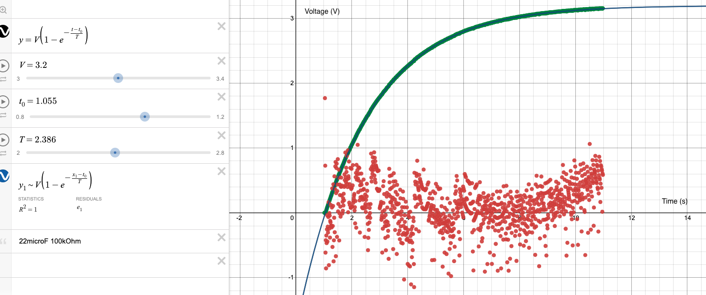
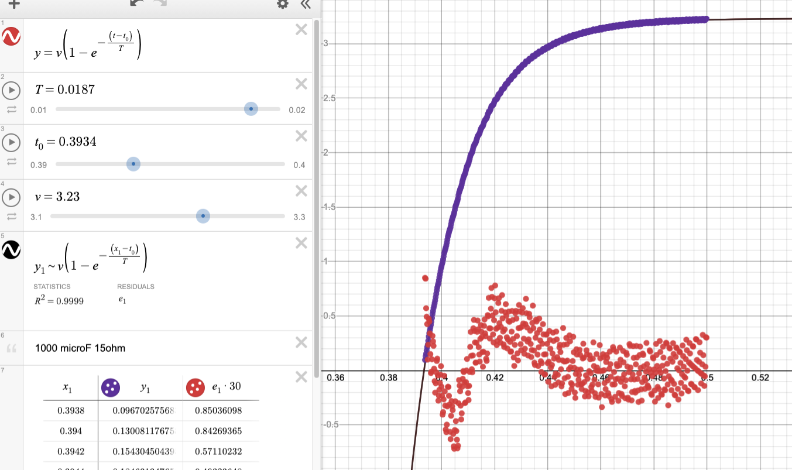

#ret 

# Purpose

To verify the relation between capacitance, resistance, voltage, and charge time of a simple capacitor circuit. The equation that will be verified is
$$
V_{cap} = V_{bat}\left(1-e^{-\frac{t}{\tau}}\right)
$$
where each variable has the following meaning:

| Variable | Units | Description |
|----------|-------|-------------|
$t$ | Seconds (s) | Time elapsed since charging of the capacitor started. May be represented as $t-t_0$, where $t$ is the current absolute time and $t_0$ is the absolute start time.
$V_{cap}$ | Volts (V) | Voltage across the capacitor after a given elapsed time
$V_{bat}$ | Volts (V) | Voltage of the battery, assumed to be constant.
$\tau$ | Seconds (s) | "Time constant" that scales the equation to the circuit. Equal to the product of the resistance and capacitance of the circuit ($RC$), and roughly equal to the number of seconds required to charge the capacitor to $\frac{2}{3}$ of $V_{bat}$.

> Table 1: The meanings of variables in the numerical model

# Voltage over Time

## Equipment

- Logger Pro probes
- Logger Pro
- Breadboard
- Capacitors (22$\mu$F, 1000$\mu$F)
- Resistors (15$\omega$-100k$\omega$)
- 3 volt battery pack

## Procedure

A number of circuits were built and capacitors measured using a voltage and amperage probe with Logger Pro. The raw data can be found [on Canvas](https://nuevaschool.instructure.com/courses/2851/assignments/52558). Desmos was used to manually fit curves to the data, using a modified version of the model with $t$ and $t_0$ variables to truncate scrap data:
$$
V_{cap} = V_{bat}\left(1-e^{-\frac{t - t_0}{\tau}}\right)
$$
The scattered points near the x-axis are residuals between the curve fit and the collected data. The fit heuristic was to visually center the dots around the x-axis.

## Results

The results of the fits are summarized below:

 

  

 

 

| $\Omega$ | F | Fit $\tau$ (s) | Modeled $\tau$ (s) | % Error |
|---------:|--:|-----------:|---------------:|--------:|
100k$\Omega$ | 22$\mu$F   | 2.3860 | 2.2000 | 8.45%
33k$\Omega$  | 1000$\mu$F | 0.0017 | 0.0016 | 9.61%
100$\Omega$  | 1000$\mu$F | 0.1058 | 0.1000 | 5.80%
15 $\Omega$  | 1000$\mu$F | 0.0188 | 0.0150 | 25.33%

> Table 2: Calculated values of $\tau$

## Analysis

The curve fits included a parameter for $\tau$, and the model predicts $\tau = RC$. Thus, the values and uncertainties for resistance and capacitance of each circuit were multiplied and compared to the visual best fit $\tau$ in the table above.

Because each fit was done manually, the absolute error was difficult to estimate because there was no correct answer. Instead, error was taken as the precision at which the number was considered "close enough" by the human doing the curve fit. Depending on the size of the value (and scale of the Desmos slider), this results in an absolute error ranging from 0.1 units to 0.001 units.

These uncertainties were propagated through calculations as follows:
$$
\delta (A+B) = \sqrt{\delta A^2 + \delta B^2}
$$
for additive combinations and 
$$
\frac{\delta (AB)}{AB} = \sqrt{\left(\frac{\delta A}{A}\right)^2 + \left(\frac{\delta B}{B}\right)^2}
$$
for multiplicative ones.

The manufacturing tolerances of electronic components were taken into account as well. Resistor tolerances were based on the absolute difference between standard resistances and those measured by a multimeter. Capacitance tolerances were based on the tolerances of a similar capacitor for which the [data sheet](http://www.paullinebarger.net/DS/Foai/Foai%20%5Bradial%20thru-hole%5D%20CD110%20Series.pdf) was available: the FOAI CD110 radial capacitor, which had capacitance tolerances of $\pm$ 20%. 

## Conclusion

Assuming perfect capacitor manufacturing, the curve fit results fell within uncertainties of the model predicted $\tau$ value for all circuits except the first. This is likely due to the high uncertainties placed on smaller scale curve fits, especially the final trial.
Furthermore, with the unexpectedly large 20% uncertainties in capacitance all trials fell within the uncertainties of the experiment. Thus, the model predicted the charging behavior of capacitors over time accurately.
For future iterations, numerical errors could have been better predicted if the specifications of the exact parts used to build the circuit were available. Additionally, more systematic curve fit heuristics could have been used such as RSME.

The exact numerical analysis for this section can be found [here](https://docs.google.com/spreadsheets/d/1Hw9ooz0CtAvTP9vtw1VT9pVyfsW39IojwwrQX94VJQY/edit?usp=sharing).

# Integration of Current

## Procedure

Another way to evaluate the model is to compare the amount of transferred charge. For this comparison, a modified equation is used: 

$$
C_{cap}=C_{max}\left(1-e^{-\frac{t-t_{0}}{\tau}}\right)
$$

This is similar to the model used in the previous procedure, but voltage variables are replaced with charge. Current flow through the circuit is used as a proxy to calculate the amount of charge accumulated in the capacitor. As before, current is measured across a resistor using a digital probe and Logger Pro.

The amount of current on the capacitor was calculated by taking a Riemann sum of the momentary current measurements. In addition, the voltage measurements across the capacitor were used as another proxy to calculate the amount of charge on the capacitor.

## Results

The values of the three theoretically identical methods of calculating capacitor charge are shown below:

In addition, the final accumulated charge calculated by the Riemann sum was 0.00319C, or the equivalent of 3.19V on the capacitor.

## Analysis

As the graph shows, both proxies of charge on the capacitor generally agree with the model but come up with smaller values of charge. Notably, the two experimental proxies don't agree with each other either, suggesting some systematic error is at play.

One culprit may be misaligned data: if the Riemann sum calculation began after charging, then the entire sum would be skewed low. However, the sum plot is not a vertical translation of the theoretical value, which suggests the effect of this issue is minimal or canceled.
Another issue may be miscalibrated sensors: if each amperage measurement was off by $10^-5$A, the cumulative affect would drag down the total as time went on. The effect of this drift can be counteracted by taking the average of readings when no charge should be flowing, multiplying by the number of data points, and subtracting the total from the final charge value. However, the calculated drift was an order of magnitude greater than the total accumulated charge, so the author did not numerically sanitize against this drift.

Although the intermediate charge values do not match the model, the final accumulated charge is sensical: 3.19 volts is close to the expected 3.2 volts. The same errors mentioned previously contribute to this difference, but the accuracy of the result suggests that the effect was canceled.

## Conclusion

The Riemann sums of measured current align with the model and expected charge calculated by the voltage on the capacitor and the definition of the Farad. Thus, the model accurately predicts experimental behavior, suggesting that it is correct. Although the graphs differed slightly, these may be attributed to the subjective curve fit metric, sensor inaccuracies while measuring small flows of current, or sensor calibration inaccuracies.
Future analysis could be more accurate by calculating the false zero point of the sensor, using various tick times to find the most effective range for that sensor, and having more accurate values for uncertainty for circuit components and the digital probe.

Source analysis [here](https://docs.google.com/spreadsheets/d/1eDmGRePGh8PVv2aKhVhv-TNJc3_n8H7HUrAMvxOG1Vs/edit?usp=sharing).

# Time Constant with Various Components

## Procedure

Most of the analysis for data collected as a class was done on the "charge rate constant" (`time/RC`) of each circuit, defined as:
$$
\frac{t}{RC}
$$

Starting with discharged capacitors, a battery was connected to the circuit and used to charge the capacitor. When voltage across the capacitor was measured to be 2$\pm$0.01

# Results

`time/RC` is a unitless scalar that represents how quickly it takes to charge any capacitor for a given voltage. Voltage data was not collected during the experiment, so the voltage is assumed to be constant across trials. If our model of capacitor charge rate is correct, we expect `time/RC` to be constant across trials. The actual data was skewed right:

By comparing the `time/RC` and different properties of each circuit, reasoning for the outliers may be deduced. The visualization of the histogram is reflected in each of the following charts by the density of points in a column. 

First, the `time/RC` values were compared with the resistance of the circuit:

Although some outliers came from circuits with high resistance, the most skewed ones came from those with least resistance. The same can be said of capacitance:

Finally, the comparison with time taken to charge the capacitor shows the strongest correlation, which is to be expected because according to the model, this value is the product of the previous two trends.

# Analysis

On explanation for the data skew is reaction time: for lower values of $\tau$, the capacitor plateaus faster near 2V and thus the time keeper may not react as quickly. Components with smaller ratings also need tighter tolerances to achieve the same relative tolerances, so smaller capacitors may have relatively higher manufactured variability.

The source analysis for these conclusions can be found [here](https://docs.google.com/spreadsheets/d/1Xf3b3GKpNSIkuoEZTTcMQ2gjTIVnO4eHE5aJD3GEjqg/edit?usp=sharing).

---
