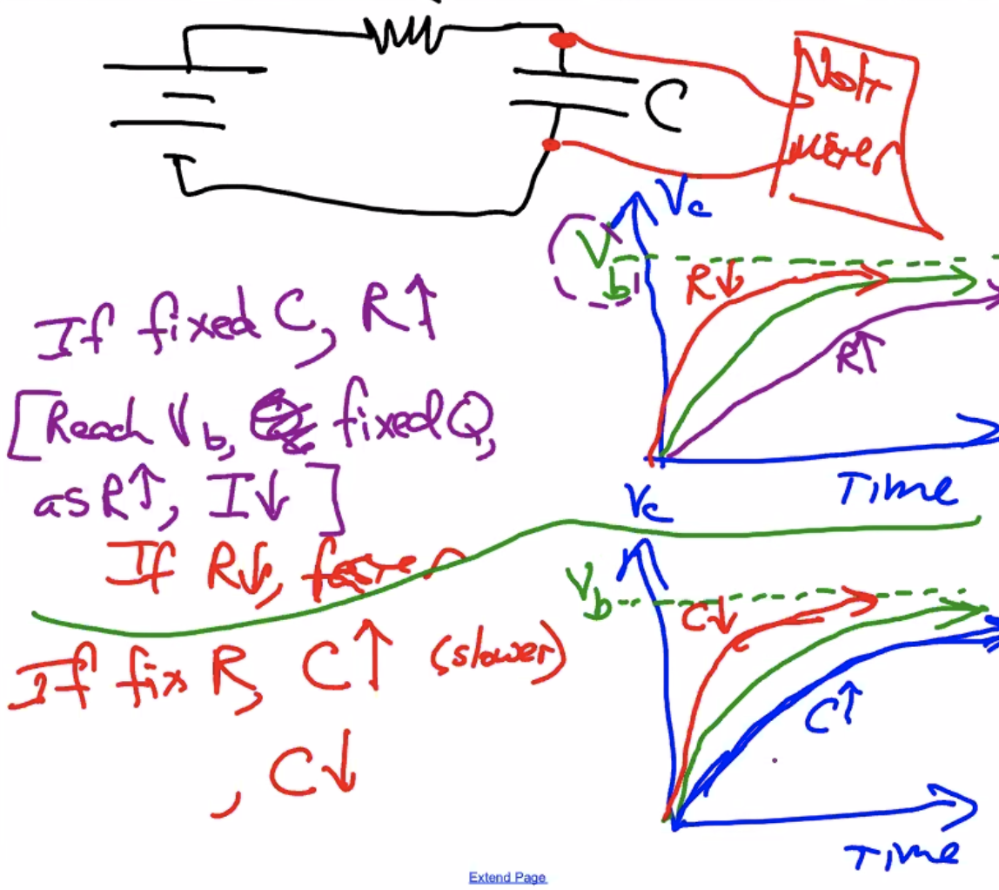
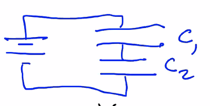
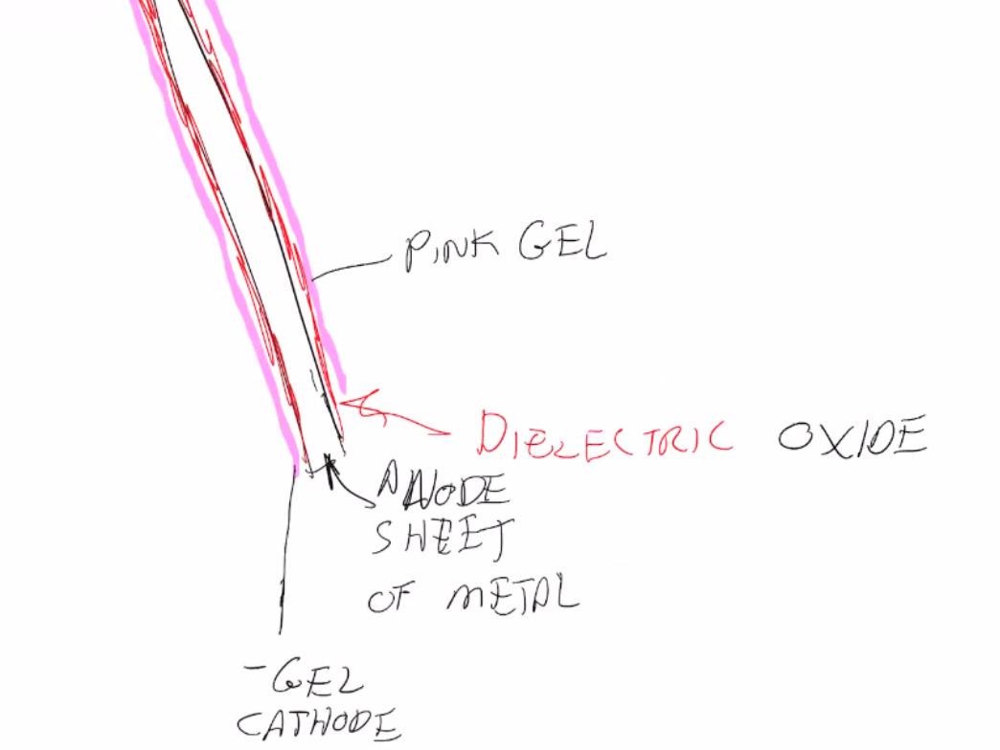

#ref

# Capacitors vs. Batteries
**Batteries** => Converting $PE_{chem}$ => Eletrical energy

**Capacitors** => Converting $PE_{elec}$ => Eletrical energy

When you are discharging a battery, they remain at constant voltage until they are used up, at which point the voltage drop like a plate.
 
When you are discharging a capacitor, there is a linear fall in voltage that is constant.

Charge remaining: capacitance times voltage

# Energy on a Capacitor

A little bit #disorganized 

Energy stored on a capacitor: $E=\frac{V_c * Q}{2}$.

Charge on a capacitor: $Q = C \times V_c$

Farads: $F = \frac{C}{V}$

So, putting this together, the energy stored on a capacitor would be...

\definition[as $Q=C \times V_c$]{Energy stored in a capacitor}{$E=\frac{V \times Q}{2} = \frac{CV^2}{2}$}

$Q_{cap} \propto V$. In fact $Q_{cap} =  C \times V_c$.

# Capacitors interacting with Resistance
As you increase the [[KBhPHYS201ResistanceConductivity]], the a capacitor of the same capacitance would charge slower. (_"Less charge flows in"_)

As you fix the Resistance, the capacitor of a higher capacitance would charge slower. (_"Need more change to fill"_)

_Charging time_ is in fairly good agreement with _resistance times capacitance_.

So... #disorganized 

Experimentally, "Charging time", $\tau$ $\approx R \times C$.

Let's check the units!

* $V = IR$
* $R = \frac{V}{I}$
* So $R = \omega = \frac{V * s}{Q}$

* $Q = CV$
* So $\frac{Q}{V} = C$

Hence, $R \times C = \frac{\cancel{V} \times s}{\cancel{Q}} = \cancel{\frac{Q}{V}}$, indeed, has a unit Seconds!

# Equations modeling charging a capacitor 
\definition[where $R$ is the resistance, $C$ is the capacitance]{Time Constant Tau}{$RC = \tau$ — time constant to be able to change the capacitor to a useful voltage; aka how much does the capacitor need to noticeably charge/discharge.}

Now that we have this value, we could also represent the full charge process using the equations as follows:

\definition[where $V_b$ is the battery voltage, $t$ is time elapsed, $R$ is resistance, and $C$ is the capacitance]{Current in circuit as you charge a capacitor}{$I(t) = \frac{V_b}{R} \times e^{\frac{-t}{RC}}$}

As you start to charge a capacitor, the current starts at $\frac{V_b}{R}$ — current just without the resistor. Then, it will slowly drop down to 0.

\definition[where $V_b$ is the battery voltage, $t$ is time elapsed, $R$ is resistance, and $C$ is the capacitance]{Voltage before and after a capacitor as you charge a capacitor}{$V(t) = V_b \times (1 - e^{\frac{-t}{RC}})$} 

#disorganized 

# Capacitors in series and parallel
Helpful to see: [[KBhPHYS201CombiningResistors]]

## Capacitors in Parallel

 

$Q_{tot} = Q_1 + Q_2$.

And, because of the fact that $C = \frac{Q}{V}$, $V\times C_{eq} = V \times C_1 + V \times C_2$

Dividing $V$ out of the previous equations $C_{eq} = C_1 + C_2$.

**Capacitors in parallel act like resistors in series.**

## Capacitors in Series

Because of the fact that the middle wire does not carry any changes, it is "neutral" and simply polarized — making $Q_1$ equaling $Q_2.$ 

Why is this? If the middle bit is neutral, the $Q^+$ on one end would equal to the $Q^-$ on the other. Correspondingly, the other side of the plates of the capacitor would have the opposite of the same values $Q^-$ and $Q^+$ on the neutral middle plate. 

By the transitive property, $Q_1 = Q_2$.

Because $V_1 + V_2 = V_b$ — see [[KBhPHYS201CombiningResistors]] & $C = \frac{Q}{V}$ , $\frac{Q_1}{V} + \frac{Q_2}{V} = \frac{Q_{tot}}{V}$.

Given $Q_1 = Q_2$.

So

## Construction of Capacitors

A diagram of the plates inside a polar capacitor before being rolled up.

