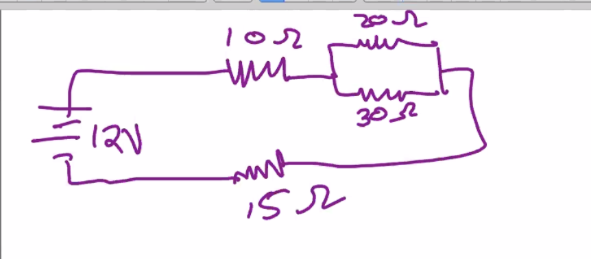

### Series
If you have two resisters…

-----|||-----|||--—

With the first having a resistance of $A\Omega$ and the second $B\Omega$. 

The total resistance would simply be $(A+B)\Omega$.

* Same as equivalent of "electricity!" go through the first then the second

#disorganized

### Parallel
Smaller area |-----|||---—
                    |
Bigger area  |===|||====

$R_2 = R_1 \times \frac{A_1}{A_2}$

$R_{eq} = R_1 \times \frac{A_1}{A_1+A_2}$

$\frac{1}{R_{eq}} = \frac{A_1+A_2}{A_1R_1}$

$\frac{1}{R_{eq}} = \frac{1}{R_1} + \frac{A_2}{A_1R_1}$

$\frac{1}{R_{eq}} = \frac{1}{R_1} + \frac{1}{R2}$

Resistance equation for series :pointup:

***

#disorganized 

Calculate resistsance 

### "Combine Resistors" Method
 

#### Parallel Resistors as Single Resistors

Per the previous resisters rules, that $\frac{1}{R_{eq}} = \frac{1}{R_1} + \frac{1}{R2}$,  we could treat the $20 \Omega$ and $30 \Omega$ in parallel as a single resistor of $12 \Omega$.

Now the circut becomes even simpler:

#### Sequence Resistors as Single Resistors

Per the sequence resisters rules, that total resistance is $(A+B)\Omega$, we could combine these three resistors as a $37 \Omega$ resistor.

#### Combined Current
We know that $12V / 37\Omega = 0.324 Amps$ is the current that returns to the battery and what the battery starts with, for if we treat the circuit as a single resistor, the 12 volts would only be working against.

From there, once we have a current for beginning and end, we could work our way up backwards by calculating the final voltage.

* Multiples battries can't be solved with the combined resistor method
* So, first guess the current flow
    * Each batteries' current will flow back to itself
    * When currents meet, they will combine
* Use currents identified before + Kirkoff's second law
* Use Kirkoff's first law to find loops (and hence equations) that, together, **covers all components**
* If resulting currents is negative, that means that you drew the current in the wrong direction, or you are charging a battery
    * Either way, if the signs are preserved to solve the rest of the equation, you should be fine numerically
    * Just update your graph to reflect the actual currents' directions

LED longer leg is positive