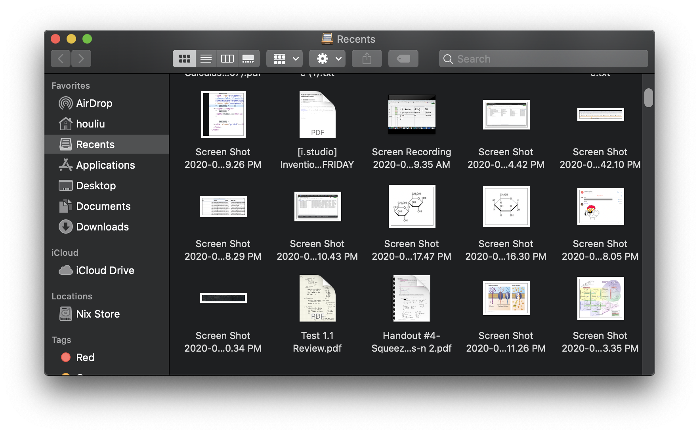

First, let's begin with...

# Electrostatics Cheat Sheet
[[KB20200825215200]]

# An atom
We begin by recognizing the fact that **it's the electron that can move around in an atom.**.

For now, materials could be either **Conductors** or **Insulators.**

* **Conductors**
    * $e^-$ move freely
    * Think! Metal
* **Insulators**
    * $e^-$ cannot move freely
    * Think! Wood/Glass/Plastic

Objects have different charge properties [[KBhPHYS201AtomChargeProps]], and they interact with each other in specific ways:

* **Like changes tend to repel**
* **Different changes tend to attract**  

[[KBhPHYS201AtomInteractions]]

### The Rods and Paper Experiment

Recall the day one at-home experiment [[KBhPHYS201D1AtHomeActivity]]. Let's see how the interactions we saw relates to the physical world:

See [[KBhPHYS201ElectrostaticPolarization]], the analysis of the Rods and Paper Experiment

### The Electroscope

See [[KBhPHYS201Electroscope]], the electroscope.
       
# Quantifying electrical force!

See [[KBhPHYS201ColoumbsLaw]], Coulomb's Law

# Gravity + Gravitational Fields!

Each object has what's called **gravitational field.** Surrounding each object has what is effectively many tiny vectors getting weaker and weaker as you move away from the Earth. You could calculate the force of gravity just by knowing…

1. The mass of what you are calculating.
2. How far away is the other object's mass.

Then, out pops a value that tells you the magnitude of force that an object would exert on another object w.r.t. their mass that was dropped right where that vector was.

To see how we could do this, and how it relates to electrostatics, see [[KBhPHYS201GravitationalFields]] Newton's Law of Gravitation.

# Electric Fields

See [[KBhPHYS201ElectricFields]] Electric Fields. 

# Applications of Electrostatics 
## Van de Graff Generator

See [[KBhPHYS201VanDeGraff]]

## Lazer Printers

See [[KBhPHYS201LazerPrinters]]
    
# Resistance and Current

See [[KBhPHYS201Resistance]]

# OMG Rosetta 2 ElectricBoogaloo

Why did you run away? Federico Viticci?

 
 
***

\definition[Welp, this is gone.]{a haha, ahahaha lalala}{writing essays?}

```js
console.log("This")
```

$\frac{12^2}{x-12}$

