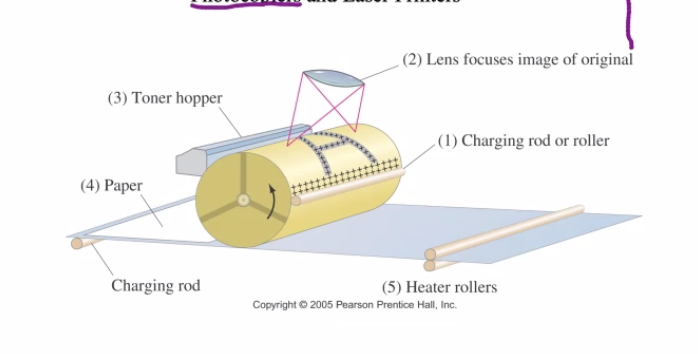

# Lazer Printers + Scanners w.r.t. Electrostatics

## Lazer scanner...
1. LED light cause original to reflect into mirror
2. Scanning drum (yellow thing) does electrostatics!
    3. Drum plated with plastic
    4. Positively charged drum gets positively charged by a smaller roller
    5. Light reflecting off of the original (the parts of the original without black ink, anyway) disturbs the positively charged roller
    6. Plastic becomes conducting where it experiences light 
    7. Drum under the positive is **grounded** — meaning it could absorb + apply an infinite amount of electrons, so any grounded conductor becomes neutral
    8. You could see from the figure above, where you have dark on the original, positive charge contributed by (4) is left on the plastic. Where you have light, the plastic becomes a conductor and the ground draws the electrons away, making light parts neutral
    9. Now, the toner powder next to the drum will only stick to the positive parts of the plastic printing drums, which, remember, is where light paper_did not_ affect
    10. And then, a copy!
    
Lazer printing works in the same way as above, except plastic becomes conducting where it experiences light from a computer-controlled laser drawing a negative of the print.