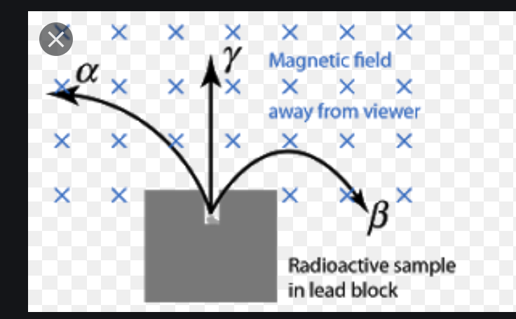

# Nuclear Physics
First of all, recall [[KBhPHYS201ColoumbsLaw]]. Given the force between two particles is $\frac{kQ^2}{R^2}$, we could hand-wavily calculate the _work_ between two particles if we know how much they travel near/far from each other. Through this, we could show that nuclear forces (through nuclear distance, proton=>electron) are much larger than that of the chemical forces (atom/atom, electron=>electron).

#compilefromnote

## Radioactivity
Radiation is the emition of waves — lights, heat, etc. etc. We call something "radioactive" if it emits ionizing radiation: that it has enough energy to liberate an electron from an atom.

### Geiger Counter
#inserthowgeigercountersowrk

Because of the fact that Geiger counters require time to discharge, there is a certain rate called "dead time" during which Geiger counters simply sit and do nothing. As such, we have to account for this lossy "deadtime" of Geiger counters by relating the two values with the following equation

$T = \frac{M}{1-(M/L)}$, where $M$ is the measured rate of radiation and $L$ is the "dead time" — the upper limit of the Geiger counter in question.

### Radio Charge Types

- $\alpha$: positively charged + relatively massive (low $\frac{q}{m}$)
- $\beta$: negatively charged + relatively high charge (high $\frac{q}{m}$)
- $\gamma$: neutral

This could be seen by how these three types of charge curve into a magnetic field.

Why? Apply right hand rule 1.5.

