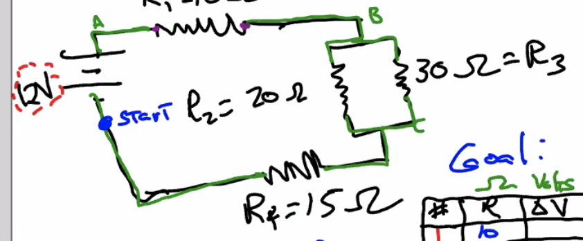

# Resistance and Current

Resistance roughly measures how much pressure against current — electron flow there is in a conductor.

## Current
Use the variable $I$, a unit $\frac{C}{s}$, $Amps$, to measure current. This also equals $\frac{\Delta V}{Resistance}$. Big resistance, little current. Current is measured in a unit $\frac{C}{s}$, which intuitively makes sense — Current/second is kind of like metres^3/second — it measures, roughly, the "amount of flow"/second.

\definition{Current $I$}{A value measured in unit $\frac{C}{s}$, a.k.a. $Amps$ that measures electron flow}

## Resistance
So, let's figure out resistance.

We know that...  $V$ = $\frac{J}{C}$, per [[KBhPHYS201Voltage]], and we also know that resistance would equal a unit $\frac{Vs}{c}$ given that $I = \frac{C}{s} = \frac{\Delta V}{Resistance}$. Plugging in the definition of voltage, we get that resistance is measured in $\frac{Js}{C^2}$. We call this unit Ohms, or $\Omega$.

\definition{Resistance $\Omega$}{A value measured in $\frac{Js}{C^2}$ that measures the resistance to current}

### Calculating resistance
* So, let's think. With a wire of length L and with a wire of area A, if we increase L, the resistance in the wire would increase; if we increase area A, the resistance in the the wire would decrease.
* $Resistance = \frac{L}{A}*ResistivityOfMaterial$ with units $\frac{m}{m^2}(\Omega \times m)$.
    
and, indeed, resistivity of materials are measured in $\Omega \times m$, which also makes sense intuitively.

## Resistors in Different configurations

### Series
If you have two resisters…

-----|||-----|||--—

With the first having a resistance of $A\Omega$ and the second $B\Omega$. 

The total resistance would simply be $(A+B)\Omega$.

* Same as equivalent of "electricity!" go through the first then the second

#disorganized

### Parallel
Smaller area |-----|||---—
                    |
Bigger area  |===|||====

$R_2 = R_1 \times \frac{A_1}{A_2}$

$R_{eq} = R_1 \times \frac{A_1}{A_1+A_2}$

$\frac{1}{R_{eq}} = \frac{A_1+A_2}{A_1R_1}$

$\frac{1}{R_{eq}} = \frac{1}{R_1} + \frac{A_2}{A_1R_1}$

$\frac{1}{R_{eq}} = \frac{1}{R_1} + \frac{1}{R2}$

Resistance equation for series :pointup:

***

#disorganized 

Calculate resistsance 

## Calculating Current in a Circut.

### Traditional Kirkob's Laws approach
A circut!

#### Kirkab's First Law
**Sum of voltage in any closed loop should add up to 0**

As in, the sum of all voltage changes from Start => Start will add up to 0.

#### Kirbob's Second law
**Net current flowing into a node is 0**

With a current $i_0$, when it flows into a junction like B, the current $i_0$ splits into $i_2$ and $i_3$

So, to calculate the resistance and current at every point o
 
 START at start
 
 * $+12$
 * $-I_1*10$ (per $I = \frac{\Delta V}{resistance}$)
 * $-I_2 * 20$
 * $-I_1 * 15$
 * $= 0$

$I_1 - I_2 - I_3 = 0$, per Kirerbab's Second Law.
 
 **Through a resistor, the Current does NOT change, the Voltage drops.**
 

