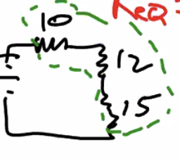

# Resistance
So, let's figure out resistance.

We know that...  $V$ = $\frac{J}{C}$, per [[KBhPHYS201Voltage]], and we also know that resistance would equal a unit $\frac{Vs}{c}$ given that $I = \frac{C}{s} = \frac{\Delta V}{Resistance}$. Plugging in the definition of voltage, we get that resistance is measured in $\frac{Js}{C^2}$. We call this unit Ohms, or $\Omega$.

\definition{Resistance $\Omega$}{A value measured in $\frac{Js}{C^2}$ that measures the resistance to current}

### Calculating resistance
* So, let's think. With a wire of length L and with a wire of area A, if we increase L, the resistance in the wire would increase; if we increase area A, the resistance in the the wire would decrease.
* $Resistance = \frac{L}{A}*ResistivityOfMaterial$ with units $\frac{m}{m^2}(\Omega \times m)$.
    
and, indeed, resistivity of materials are measured in $\Omega \times m$, which also makes sense intuitively.

## Resistors in Different configurations

### Series
If you have two resisters…

-----|||-----|||--—

With the first having a resistance of $A\Omega$ and the second $B\Omega$. 

The total resistance would simply be $(A+B)\Omega$.

* Same as equivalent of "electricity!" go through the first then the second

#disorganized

### Parallel
Smaller area |-----|||---—
                    |
Bigger area  |===|||====

$R_2 = R_1 \times \frac{A_1}{A_2}$

$R_{eq} = R_1 \times \frac{A_1}{A_1+A_2}$

$\frac{1}{R_{eq}} = \frac{A_1+A_2}{A_1R_1}$

$\frac{1}{R_{eq}} = \frac{1}{R_1} + \frac{A_2}{A_1R_1}$

$\frac{1}{R_{eq}} = \frac{1}{R_1} + \frac{1}{R2}$

Resistance equation for series :pointup:

***

#disorganized 

Calculate resistsance 

## Calculating Current in a Circut.

### Traditional Kirkoff's Laws approach
A circut!

#### Kirkoff's First Law
**Sum of voltage in any closed loop should add up to 0**

As in, the sum of all voltage changes from Start => Start will add up to 0.

#### Kirkoff's Second law
**Net current flowing into a node is 0**

With a current $i_0$, when it flows into a junction like B, the current $i_0$ splits into $i_2$ and $i_3$

So, to calculate the resistance and current at every point o
 
 START at start
 
 * $+12$
 * $-I_1*10$ (per $I = \frac{\Delta V}{resistance}$)
 * $-I_2 * 20$
 * $-I_1 * 15$
 * $= 0$

$I_1 - I_2 - I_3 = 0$, per Kirerbab's Second Law.
 
 **Through a resistor, the Current does NOT change, the Voltage drops.**
 
### "Combine Resistors" Method
 

#### Parallel Resistors as Single Resistors

Per the previous resisters rules, that $\frac{1}{R_{eq}} = \frac{1}{R_1} + \frac{1}{R2}$,  we could treat the $20 \Omega$ and $30 \Omega$ in parallel as a single resistor of $12 \Omega$.

Now the circut becomes even simpler:

#### Sequence Resistors as Single Resistors

Per the sequence resisters rules, that total resistance is $(A+B)\Omega$, we could combine these three resistors as a $37 \Omega$ resistor.

#### Combined Current
We know that $12V / 37\Omega = 0.324 Amps$ is the current that returns to the battery and what the battery starts with, for if we treat the circuit as a single resistor, the 12 volts would only be working against.

From there, once we have a current for beginning and end, we could work our way up backwards by calculating the final voltage.
