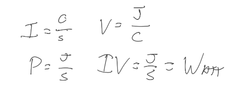

# Resistance
So, let's figure out resistance.

We know that...  $V$ = $\frac{J}{C}$, per [[KBhPHYS201Voltage]], and we also know that resistance would equal a unit $\frac{Vs}{c}$ given that $I = \frac{C}{s} = \frac{\Delta V}{Resistance}$ (see [[KBhPHYS201Current]] Current). Plugging in the definition of voltage, we get that resistance is measured in $\frac{Js}{C^2}$. We call this unit Ohms, or $\Omega$.

\definition{Resistance $\Omega$}{A value measured in $\frac{Js}{C^2}$ that measures the resistance to current}

### Calculating resistance
* So, let's think. With a wire of length L and with a wire of area A, if we increase L, the resistance in the wire would increase; if we increase area A, the resistance in the the wire would decrease.
* $Resistance = \frac{L}{A}*ResistivityOfMaterial$ with units $\frac{m}{m^2}(\Omega \times m)$.

Sometimes its easier to think about conductivity.
    
and, indeed, resistivity of materials are measured in $\Omega \times m$, which also makes sense intuitively.

### Heat of resistance

# Ohm
$$\Omega = \dfrac{\text{V}}{\text{A}} = \dfrac{1}{\text{S}} = \dfrac{\text{W}}{\text{A}^2} = \dfrac{\text{V}^2}{\text{W}} = \dfrac{\text{s}}{\text{F}} = \dfrac{\text{H}}{\text{s}} = \dfrac{\text{J} {\cdot} \text{s}}{\text{C}^2} = \dfrac{\text{kg} {\cdot} \text{m}^2}{\text{s} {\cdot} \text{C}^2} = \dfrac{\text{J}}{\text{s} {\cdot} \text{A}^2}=\dfrac{\text{kg}{\cdot}\text{m}^2}{\text{s}^3 {\cdot} \text{A}^2}$$ (Wikipedia)
