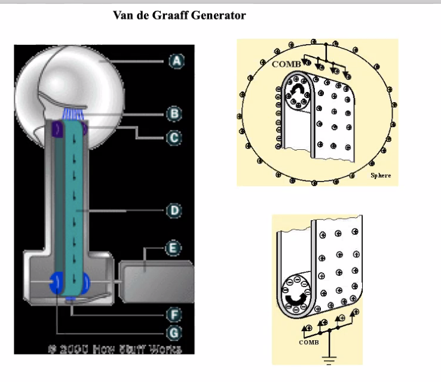

# A Van De Graff Generator

  
## Basic Procedures 
1. User turns crank
2. User brings handle to the globe
3. Electrostatic Bang!
  
## But, how does it work?
* Cranks connects to a white roller, and next to it some metal teeth
* Roller connnects to transparent belt, and on the other end, under the globe, there is a similar roller
* Metal combs next to rollers 
* When cranks are turned, the bottom roller becomes negative, and the top roller becomes positive
* So, electron flow between handle (connected to bottom) and globe (connected to top) 
        
## Why Van de Graff is so exciting
 Van de graff generator so exciting because, unlike normal statics, charges are added from the inside (see, wire B from the figure)
 
 * When you add additional changes, because conductor wants to stay 0, the additional charges can't do anything but accept it 
 * Sphere slightly curved to make up for gaping hole
 * Normal door-handle statics would much rater simply eject the added change  as their electric field is pointed at one direction against charge introduction
 
## Why are there sparks through the air?
 * One dome that's positive, one dome is negative
 * So, what happens when Spark! happens?
     * Enough charge to overcome the electric field resistance [[KBhPHYS201ResistanceConductivity]] of air (like 3.4 million Volts/metre), and **air ionizes** — air atoms becomes so attracted that their electrons ditch their nuclei and air suddenly becomes a conductors
     * Neutral air has high resistance, but when it ionizes, the air looses its resistance (drops) and becomes nicely conductive
     * So then, current (Coulomb/s) that flow in the air suddenly spark up because of sudden loss of resistance, discharging the negative dom
