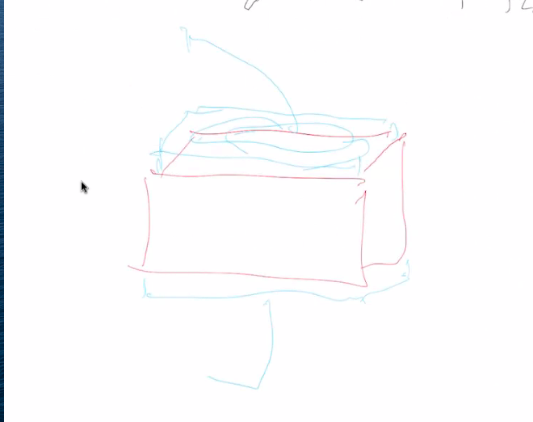

#ret #question

- Electrostatics
	- Charged plates for 31 August 2020
		- Q: Charges are applied to plates, but no charge flows. It just creates electrostatic fields which causes charges to flow in the neutral conductor.
		- Q: With the charged plates, if there was no neutral conductor, would the field stay uniform? (Because there is no equilibrium to be reached)
			- A: Yes, there is no movement and no equilibrium. The field is uniform.
		- Q: Where exactly is the $E_net = 0$ range in the central neutral conductor with hole? Does it extend outside, since the charges have flowed within the conductor to make it neutral?
			- A: No, the field still exists between the plate and the conductor because there is still a charge difference. The inside of the conductor has a counteracting field, but between the conductor and the plate is just a smaller version of two charged plates creating an Efield.
			![[20phys201srcConductorNeutralizesField.png]]
			![[20phys201srcConductorAsChargedPlate.png]]
	- Vandegraph
		- How does the ground comb keep depositing charge onto the rubber belt?
			- The dominant charge at either end of the belt is not from the belt but from the roller.  Most of the charge on the belt gets carried away, but the charge on the roller builds up.  For example, at the bottom, the belt is getting charge with electrons, which travel away and the roller is charged positively.  The positive charge of the roller creates a field that tries to rip electrons off the comb.  The electrons land on the belt and get carried up to the ball.  At the top, the opposite happens.
		- How does a spark / lightning create sound?
			- plasma is much harder so the air expands and then contracts. we hear the air particles slamming into each other.
		- Why is the belt on a vandegraph generator so long? 
			- Probably to keep the ball away from the base
- Circuits
	- Resistors
		- Isn't there resistance while electrons travel across the cross-sectional area if there's a point wire?
		- Blue = aluminum
		

---
