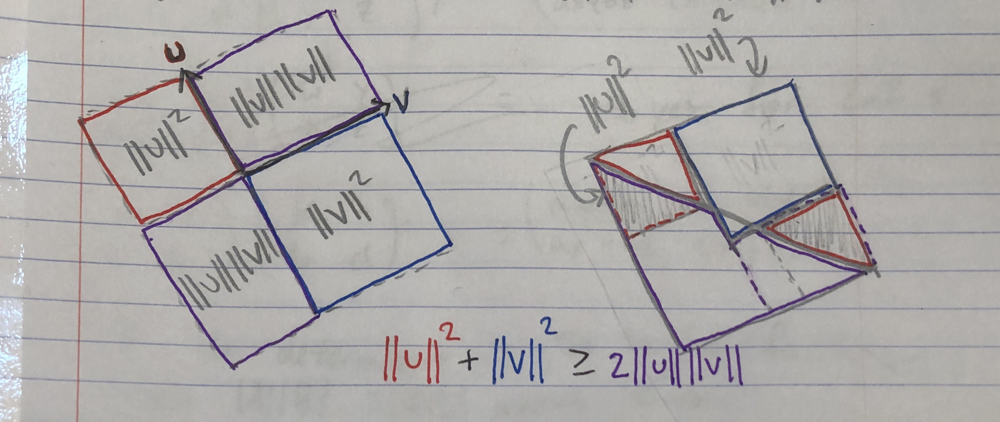

# Axler 6.A exercise 9 {#axler-6.a-exercise-9-1}

> Suppose $u, v \in V$ and $\lVert u \rVert \leq  1$ and
> $\lVert v \rVert \leq  1$. Prove that $$\begin{aligned}
> \sqrt{1-\lVert u\rVert^2}\sqrt{1-\lVert u \rVert ^2} \leq  1- | \langle u, v \rangle |
> \end{aligned}$$

# Proof

## Useful Lemma

> $$\begin{aligned}
> \lVert u \rVert ^2 + \lVert v \rVert ^2 \geq 2 \lVert u \rVert \lVert v \rVert
> \end{aligned}$$

This proof is only valid for inner product spaces over $\mathbb{F}^n$
and the Euclidean norm. An algebraic proof would be better.

## Cauchy-Schwarz Corollary

$$\begin{aligned}
  \lvert \langle u, v \rangle \rvert &\leq \lVert u \rVert \lVert v \rVert \implies 1- \lVert u \rVert \lVert v \rVert &\leq 1- \lvert \langle u, v \rangle \rvert
  \end{aligned}$$

## Main Proof

Now, to show that the square of the left hand side is less than or equal
to the square of the right hand side,

$$
  \begin{aligned}
  (1-\lVert u \rVert ^2)(1- \lVert v \rVert ^2) =& 1-\lVert u \rVert ^2 - \lVert v \rVert ^2 + \lVert u \rVert ^2 \lVert v \rVert ^2\\
  =& 1- (\lVert u \rVert ^2 + \lVert v \rVert ^2 ) + \lVert u \rVert ^2 \lVert v \rVert ^2\\
  \leq & 1 - 2\lVert u \rVert \lVert v \rVert + \lVert u \rVert ^2 \lVert v \rVert ^2          &&\text{by the earlier lemma}\\
  =& (1-\lVert u \rVert \lVert v \rVert ) ^2\\
  \leq& (1- \lvert \langle u, v \rangle \rvert ) ^2                                            &&\text{by the Cauchy-Schwarz corollary}
  \end{aligned}
  $$

Taking square roots of both sides proves the desired result.
`\hfill`{=latex} ▪
