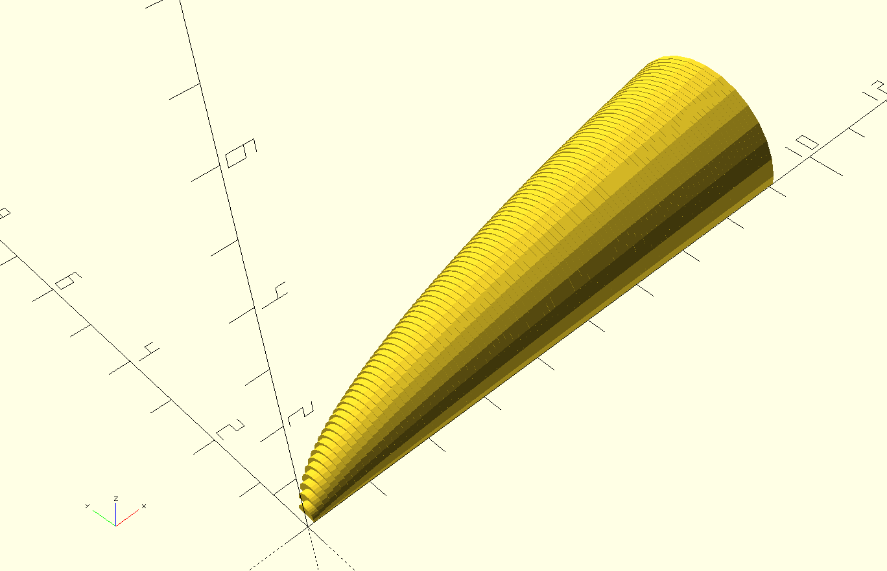

```{=org}
#+CONTEXT: 21math401
```
I chose to use Reigon B (bounded by x=0, y=sqrt(x), and x=9) and the
semicircle as my cross section. The integral to calculate the volume is
`\color{NavyBlue}`{=latex}the integral of
`\color{OliveGreen}`{=latex}the area of `\color{Melon}`{=latex}each
slice`\color{Black}`{=latex}.

$$\begin{aligned}
 &\textcolor{NavyBlue}{\int_{0}^{9}} \textcolor{OliveGreen}{\pi} \textcolor{Melon}{r_x} \textcolor{OliveGreen}{^2} \textcolor{NavyBlue}{dx}\\
 =&\textcolor{NavyBlue}{\int_{0}^{9}} \textcolor{OliveGreen}{\pi}  \textcolor{Melon}{\left(\frac{\sqrt{x}}{2}\right)}\textcolor{OliveGreen}{^2} \textcolor{NavyBlue}{dx}\\
 =& \frac{\pi}{4}  \int_{0}^{9} x dx\\
 =& \frac{\pi}{8} 9^2\\
 =& \boxed{\frac{81\pi}{8}}\\
\end{aligned}$$

This value is corroborated to four decimal points using the slice
generator. The final model can be
`\color{Blue}`{=latex}[downloaded](https://github.com/SkoolNotes/Taproot/blob/main/21math401/KBe21math401retCrossSectionSolidFinalB.scad)
`\color{Black}`{=latex} and viewed in
`\color{Blue}`{=latex}[OpenSCAD](https://openscad.org/downloads.html)
`\color{Black}`{=latex} or seen here:


