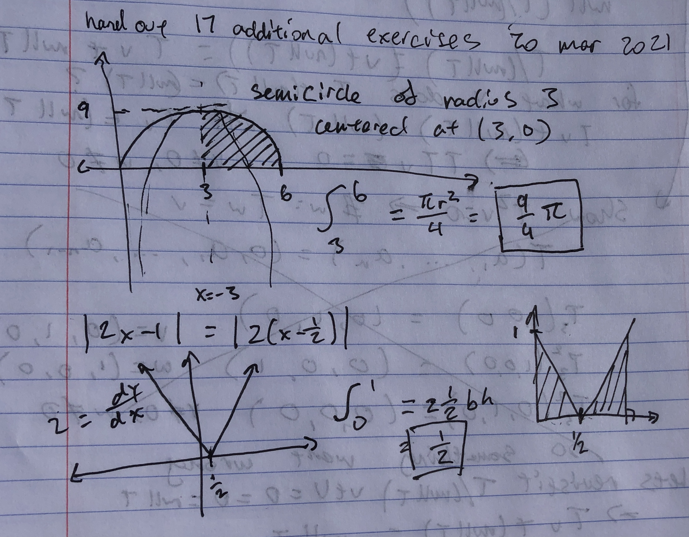

# Exercises

## interpreting in terms of area



```{=latex}
\setcounter{subsection}{2}
```
## subtracting integrals

I expect $$\begin{aligned}
   \int_1^2f(x)dx = \int_1^5f(x)dx - \int_2^5f(x)dx = -3-4 = -7
   \end{aligned}$$

In fact, I expect $$\begin{aligned}
   \int_a^bf(x)dx + \int_b^cf(x)dx = \int_a^cf(x)dx
   \end{aligned}$$

## show $\int_a^b x^2dx = \frac{b^3-a^3}{3}$

(see attached pages)

Keep in mind $$\begin{aligned}
   \sum_{k=1}^n af(x) = a\sum_{k=1}^n f(x)\\
   \sum_{k=1}^n \left( a+f(x)\right)  = an + \sum_{k=1}^{n} f(x)
   \end{aligned}$$

$$\begin{aligned}
   \int_a^b x^2 dx &= \lim_{n\to \infty} \sum_{k=1}^n \left( \frac{b-a}{n} \left( a+k\frac{b-a}{n}\right) ^2\right)\\
   &= \lim_{n\to \infty} \frac{b-a}{n} \sum_{k=1}^n \left( a+k\frac{b-a}{n}\right) ^2\\
   &= \lim_{n\to \infty} \frac{b-a}{n} \sum_{k=1}^n \left( a^2+\left( k\frac{b-a}{n}\right) ^2 + 2ak\frac{b-a}{n}\right) \\
   &= \lim_{n\to \infty} \frac{b-a}{n} \sum_{k=1}^n a^2+\sum_{k=1}^n \left( k\frac{b-a}{n}\right) ^2 +\sum_{k=1}^n  2ak\frac{b-a}{n} \\
   &= \lim_{n\to \infty} \frac{b-a}{n} \left( a^2n +\sum_{k=1}^n k^2\left(\frac{b-a}{n}\right)^2 +2a\frac{b-a}{n}\sum_{k=1}^n k\right)  \\
   &= \lim_{n\to \infty} \frac{b-a}{n} \left( a^2n + \left(\frac{b-a}{n}\right)^2\sum_{k=1}^n k^2 +2a\frac{b-a}{n}\sum_{k=1}^n k\right)  \\
   &= \lim_{n\to \infty} \frac{b-a}{n} \left( a^2n + \left(\frac{b-a}{n}\right)^2 \frac{n(n+1)(2n+1)}{6} +2a\frac{b-a}{n}\frac{n(n+1)}{2}\right)  \\
   &= \lim_{n\to \infty} (b-a) \left( a^2 + \left(\frac{b-a}{n}\right)^2 \frac{(n+1)(2n+1)}{6} +\cancel{2}a\frac{b-a}{n}\frac{(n+1)}{\cancel{2}}\right)  \\
   &= \lim_{n\to \infty} (b-a) \left( a^2 + \frac{(b-a)^2}{n^2} \left( n\frac{(2n+1)}{6} + \frac{(2n+1)}{6}\right) +a\frac{b-a}{n}(n+1)\right)  \\
   &= \lim_{n\to \infty} (b-a) \left( a^2 + \frac{(b-a)^2}{n^2} \left( n\frac{(2n+1)}{6} + \frac{(2n+1)}{6}\right) +a\cancel{n}\frac{b-a}{\cancel{n}}+a\frac{b-a}{n}\right)  \\
   &= \lim_{n\to \infty} (b-a) \left( a^2 + \frac{(b-a)^2}{n^2} \left( n\frac{(2n+1)}{6} + \frac{(2n+1)}{6}\right) +a(b-a) +\cancelto{0}{a\frac{b-a}{n}}\right)  \\
   &= \lim_{n\to \infty} (b-a) \left( a^2 + \frac{(b-a)^2}{n^{\cancel{2}} } \cancel{n} \frac{(2n+1)}{6} + \cancelto{0}{\frac{(b-a)^2}{n^2} \frac{(2n+1)}{6}} +a(b-a) \right)  \\
   &= \lim_{n\to \infty} (b-a) \left( a^2 + \frac{(b-a)^2}{n} \frac{(2n+1)}{6} + a(b-a) \right)  \\
   &= \lim_{n\to \infty} (b-a) \left( a^2 + \frac{\cancel{n}}{3}\frac{(b-a)^2}{\cancel{n}} + \cancelto{0}{\frac{1}{6}\frac{(b-a)^2}{n}} + a(b-a) \right)  \\
   &= \lim_{n\to \infty} (b-a) \left( a^2 + \frac{(b-a)^2}{3} + a(b-a) \right)  \\
   &= a^2(b-a) + \frac{b^2+a^2-2ab}{3}(b-a) + a(b-a)^2 \\
   &= \frac{1}{3}\left( 3a^2(b-a) + b^2(b-a)+a^2(b-a)-2ab(b-a) + 3a(b-a)^2\right) \\
   &= \frac{1}{3}\left( 3a^2b -3a^3 + b^3 - ab^2 + a^2b - a^3 - 2ab^2 + 2a^2b + 3a(b^2+a^2-2ab)\right) \\
   &= \frac{1}{3}\left( 3a^2b -3a^3 + b^3 - ab^2 + a^2b - a^3 - 2ab^2 + 2a^2b + 3ab^2+3a^3-6a^2b\right) \\
   &= \frac{1}{3}\left( 3a^2b-6a^2b -3a^3- a^3+ 3a^3 + b^3 + a^2b+ 2a^2b - ab^2 - 2ab^2  + 3ab^2 \right) \\
   &= \frac{1}{3}\left( -3a^2b + 3a^2b - a^3 + b^3 \right) \\
   &= \frac{1}{3}\left(b^3 - a^3 \right) \\
   &= \frac{b^3 - a^3 }{3} \\
   \end{aligned}$$
