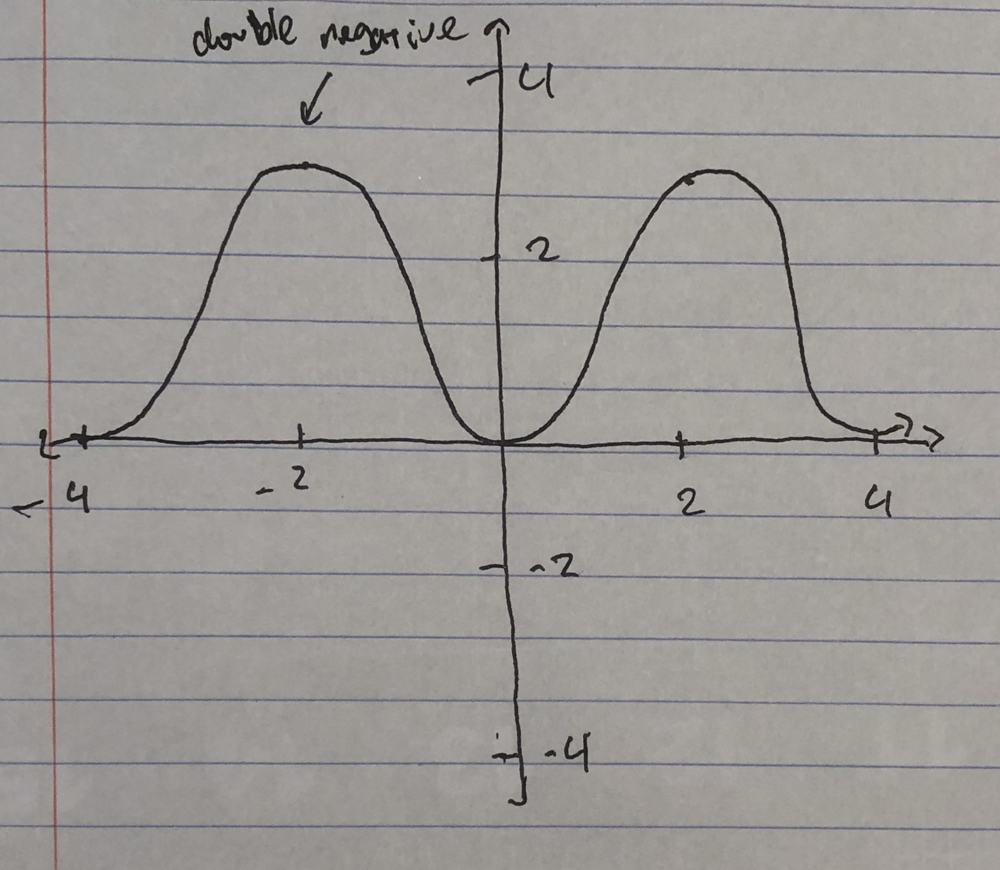
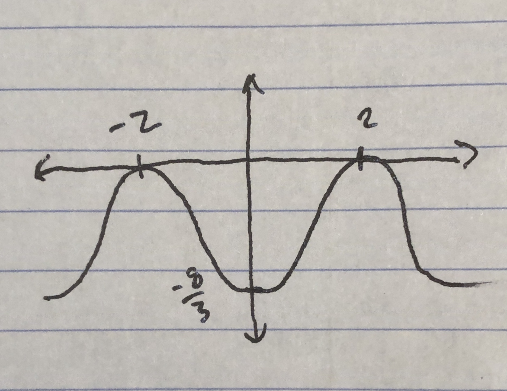
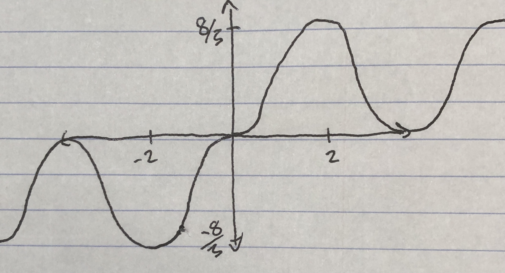
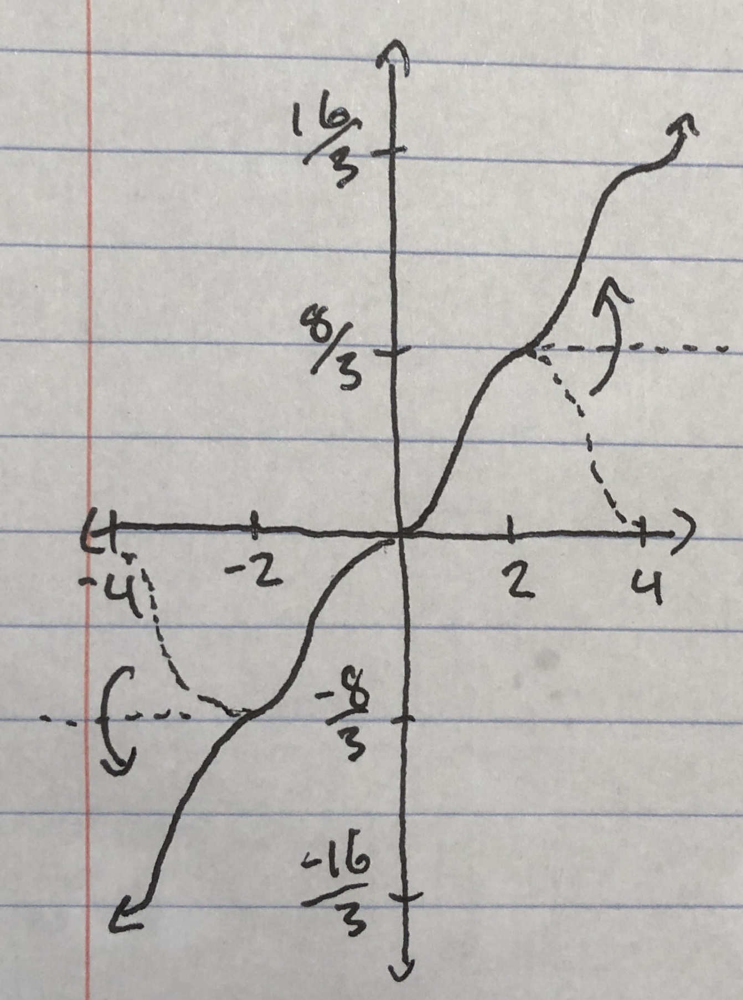

# Let $F(x) = \int_{0}^{x} f(t) dt$

## complete the table

  ------ ----- --------------- --------------- --------------- -----
  x      0     1               2               3               4
  F(x)   $0$   $\frac{4}{3}$   $\frac{8}{3}$   $\frac{4}{3}$   $0$
  ------ ----- --------------- --------------- --------------- -----

## sketch the function

# $G(x) = \int_{2}^{x} f(t) dt$

## complete the table

  ------ ---------------- ---------------- ----- ----------------- ----------------
  x      0                1                2     3                 4
  G(x)   $-\frac{8}{3}$   $-\frac{4}{3}$   $0$   \-$\frac{4}{3}$   $-\frac{8}{3}$
  ------ ---------------- ---------------- ----- ----------------- ----------------

## sketch the function

# $H(x) = \int_4^x f(t) dt$

## complete the table

  ------ ----- --------------- --------------- --------------- -----
  x      0     1               2               3               4
  H(x)   $0$   $\frac{4}{3}$   $\frac{8}{3}$   $\frac{4}{3}$   $0$
  ------ ----- --------------- --------------- --------------- -----

## sketch the function

same as 1b

# complete the table

  ----------- -------------- -------- --------
              $F(x)$         $G(x)$   $H(x)$
  maximum     4n+2                    
  minimum     4n                      
  increases   $$4n, 4n+2$$            
  decreases   $$4n-2, 4n$$            
  ----------- -------------- -------- --------

The other columns are the same, because $H(x) = F(x)$ and
$G(x) = H(x)-\frac{8}{3}$.

# why does it work over the entire domain?

The argument for each cell is the same: it should work across the domain
because those are the points where the derivative of $F(x)$ (which is
$f(x)$) is zero and function is periodic.

$F(x)$ increases when $f(x)$ is positive.

# family of functions

Changing the \'zero point\' of the derivative just shifts the graph up
and down, by up to the range of the function.

# sketching more functions

## $F_1(x) = \int_{x}^{0} f(t) dt$

$F(x)$ but reflected across the x-axis (negated)

## $F_2(x) = \int_{0}^{x} f(-t) dt$

$f$ is an odd function so $f(-t) = -f(t)$ so $F_2 = F_1$

## $F_3(x) = \int_{0}^{2x} f(t) dt$

$F_3(x) = F(2x)$ which is a parent function transformation which
compresses the graph along the x-axis.

## $F_4(x) = \int_{0}^{x} f(|t|) dt$

For $x \ge 0$, $F_4(x) = F(x)$. However, for $x < 0$, the function will
be the negative of the $x\geq 0$ case because the integral is from right
to left.

## $F_5(x) = \int_{0}^{x} |f(t)| dt$

Instead of being a periodic function, this function will be even (all
the decreasing parts of $F(x)$ become increasing with the same shape)

# derivatives of integral functions

## $F(x) = \int_{-1}^{x^2} \sin(t^3-1) dt$

$$\begin{aligned}
   f(x) &= \int_{-1}^{x} \sin(t^3-1) dt\\
   F(x) &= f(x^2)\\
   \frac{d}{dx}F(x) &= \frac{d}{dx}f(x^2)\\
   &= f'(x^2)(2x)\\
   &= 2x \sin (x^{2^3}-1)
   \end{aligned}$$

## $F(x) = \int_{0}^{2x} \ln(t-3) dt$

$$\begin{aligned}
   \frac{d}{dx}\left( \int_{0}^{2x} \ln(t-3) dt\right) &= 2 \frac{d}{dx}\int_{0}^{2x} \ln(t-3)dt\\
   &= 2 \ln(2x-3)
   \end{aligned}$$
